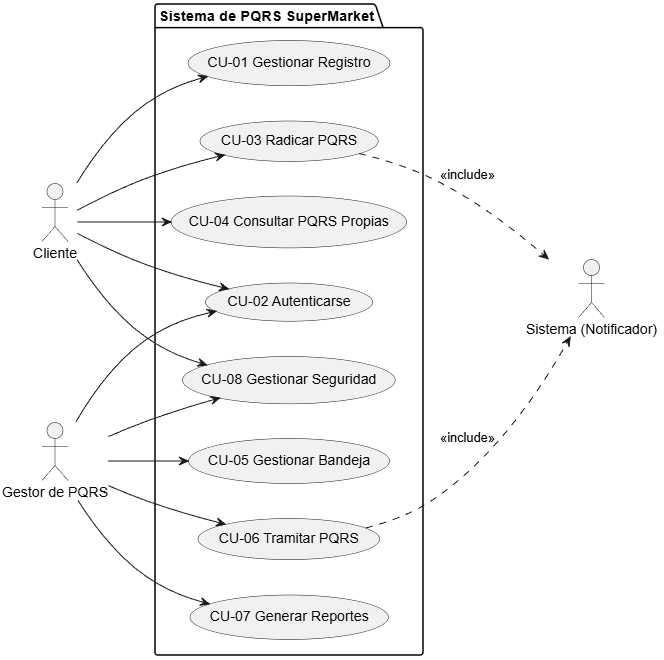

# RESUMEN Y CATÁLOGO DE CASOS DE USO

## 1. Introducción
Este documento centraliza los Casos de Uso (CU) definidos para el sistema de PQRS de SuperMarket, abarcando las funcionalidades tanto de la App Móvil (Cliente) como de la Aplicación Web (Gestor). 

## 2. Actores del Sistema
Los actores identificados que interactúan con las funcionalidades descritas son:

1. **Cliente (Ciudadano):** Actor principal. Persona natural que utiliza la App Móvil para registrar, consultar y radicar sus peticiones, quejas, reclamos y sugerencias.
2. **Gestor de PQRS:** Actor principal (Administrador). Empleado de SuperMarket que utiliza la Aplicación Web para gestionar, tramitar y dar respuesta a las solicitudes ingresadas.
3. **Sistema (Notificador):** Actor secundario/automático. Componente del sistema encargado de disparar eventos automáticos como el envío de correos electrónicos.

## 3. Catálogo de Casos de Uso
Con base en las 17 funcionalidades iniciales, se han estructurado los siguientes **8 Casos de Uso** principales:

*   **[CU-01] Gestionar Registro de Cliente:** Abarca el registro manual (App) y el registro automático en la base de datos al momento de radicar si no existe.
*   **[CU-02] Autenticarse en el Sistema:** Proceso de login tanto para Clientes (App) como para Gestores (Web).
*   **[CU-03] Radicar PQRS:** Flujo principal de creación de la PQRS (incluye adjuntar PDF y la notificación automática de confirmación).
*   **[CU-04] Consultar PQRS Propias:** Listado y filtrado del historial de PQRS de un Cliente específico en la App.
*   **[CU-05] Gestionar Bandeja de Entrada:** Listado y filtrado general de PQRS para el Gestor en la Web.
*   **[CU-06] Tramitar PQRS:** Descarga de anexos y cambio de estado de una solicitud por parte del Gestor (incluyendo notificación de cambio al Cliente).
*   **[CU-07] Generar Reportes:** Exportación a PDF de la bandeja filtrada/no filtrada (Gestor).
*   **[CU-08] Gestionar Seguridad de la Cuenta:** Recuperación de contraseña, cambio de credenciales y cierre de sesión.

---

## 4. Diagrama General de Casos de Uso

