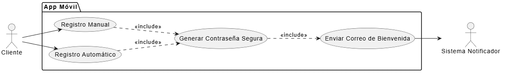

# CU-01: Gestionar Registro de Cliente

## 1. Descripción
Permite a un usuario no registrado (ciudadano) inscribirse en el sistema para poder tramitar una PQRS. El registro puede ser manual (iniciado explícitamente desde la App) o automático (cuando intenta radicar y no existe en la base de datos).

## 2. Actores
* **Cliente:** Persona natural que provee sus datos.
* **Sistema (Notificador):** Envía el correo electrónico de confirmación.

## 3. Precondiciones
* El dispositivo debe contar con conexión a internet.
* El usuario no debe estar previamente registrado con el mismo número de identificación y/o correo electrónico.

## 4. Flujo Principal (Registro Manual)
1. El Cliente abre la App Móvil.
2. Selecciona la opción "Registrarse".
3. El sistema despliega un formulario solicitando: Tipo de identificación, Número de identificación, Nombre completo, Correo electrónico y Teléfono móvil.
4. El Cliente diligencia la información y presiona "Crear Cuenta".
5. El sistema valida los datos ingresados (campos no vacíos, formato de correo, etc.).
6. El sistema verifica en la Base de Datos que el usuario no exista.
7. El sistema almacena la información del Cliente.
8. El sistema autogenera una contraseña segura (mínimo 6 caracteres, 1 mayúscula, 1 minúscula, 1 número) y la asocia a la cuenta.
9. El Sistema Notificador envía un correo electrónico al Cliente con sus credenciales de acceso.
10. El sistema informa al Cliente que el registro fue exitoso.

## 5. Flujos Alternativos

*   **Flujo Alternativo 1 (Registro Automático durante Radicación):**
    1. El usuario intenta radicar una PQRS llenando el formulario completo (incluyendo sus datos personales).
    2. El sistema detecta que el número de identificación no está registrado.
    3. El sistema ejecuta internamente los pasos del 7 al 9 del Flujo Principal, sin interrumpir el proceso de radicación de la PQRS.
*   **Flujo Excepción 1 (Cliente ya registrado):**
    En el paso 6, si el sistema detecta que el correo o número de identificación ya existe, aborta la creación y notifica al usuario que "El cliente ya se encuentra registrado", sugiriéndole ir a 'Recuperar Contraseña'.

## 6. Diagrama del Caso de Uso

