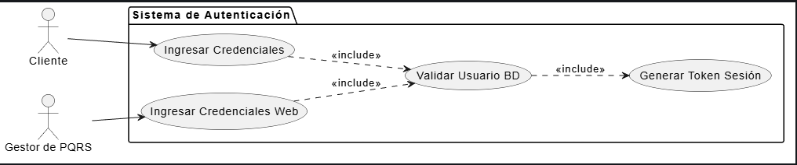

# CU-02: Autenticarse en el Sistema

## 1. Descripción
Permite a los usuarios (Clientes en la App Móvil y Gestores en la Aplicación Web) acceder de forma segura a sus respectivas cuentas para realizar operaciones en el sistema.

## 2. Actores
* **Cliente:** Actor que ingresa a la App Móvil.
* **Gestor de PQRS:** Actor que ingresa a la Aplicación Web.

## 3. Precondiciones
* El Cliente debe haber sido registrado previamente (manual o automáticamente) y poseer sus credenciales.
* El Gestor de PQRS debe tener una cuenta administrativa previamente creada en el módulo de seguridad.

## 4. Flujo Principal (Autenticación del Cliente)
1. El Cliente abre la App Móvil.
2. Selecciona la opción "Iniciar Sesión".
3. El sistema muestra los campos: "Número de Identificación" y "Contraseña".
4. El Cliente ingresa sus datos y presiona "Ingresar".
5. El sistema cifra la contraseña ingresada y la compara con la almacenada en la base de datos de SuperMarket.
6. El sistema valida las credenciales y el estado activo del usuario.
7. El sistema genera un token de sesión (autenticación exitosa).
8. El sistema redirige al Cliente a su pantalla de inicio (Historial de Radicados).

## 5. Flujos Alternativos

*   **Flujo Alternativo 1 (Autenticación del Gestor en Web):**
    1. El Gestor ingresa a la URL de la Aplicación Web.
    2. El sistema despliega un formulario de inicio de sesión (Usuario y Contraseña).
    3. El Gestor ingresa sus datos.
    4. El sistema valida que el usuario sea administrador y tenga permisos activos.
    5. Si es correcto, el sistema le concede acceso y lo redirige a la Bandeja de Radicados General.
*   **Flujo Excepción 1 (Credenciales Inválidas):**
    En el paso 6, si la contraseña es incorrecta o el usuario no existe, el sistema no concede acceso y despliega un mensaje de error: "Usuario o contraseña incorrectos", invitando al usuario a volver a intentar o a recuperar su contraseña.

## 6. Diagrama del Caso de Uso

