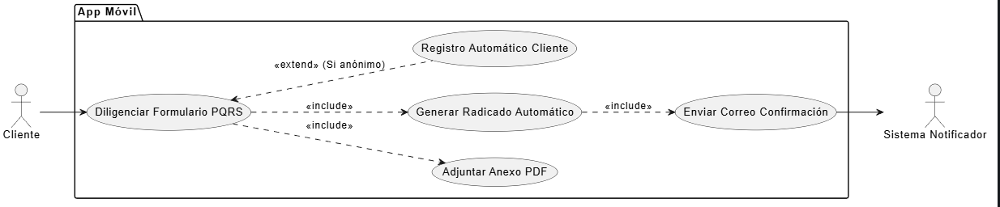

# CU-03: Radicar PQRS

## 1. Descripción
Es el proceso central (core) mediante el cual un Cliente ingresa una nueva Petición, Queja, Reclamo o Sugerencia en la App Móvil, adjuntando la documentación de soporte (PDF) requerida, y el sistema genera automáticamente un número de radicado y lo notifica por correo electrónico.

## 2. Actores
* **Cliente:** Actor que inicia la radicación.
* **Sistema (Notificador):** Actor encargado de enviar el correo electrónico confirmando el registro.

## 3. Precondiciones
* El Cliente debe estar dentro de la App Móvil, preferiblemente (pero no obligatoriamente) autenticado.
* El dispositivo debe tener conexión a internet estable para la subida del documento anexo (PDF).

## 4. Flujo Principal (Cliente Autenticado)
1. El Cliente (autenticado) selecciona la opción "Radicar Nueva PQRS".
2. El sistema despliega un formulario. Los datos del Cliente (Identificación, Nombre, Correo, Teléfono) ya aparecen autocompletados e inmodificables.
3. El Cliente diligencia la información de la PQRS (Tipo de radicado: Petición, Queja, Reclamo, Sugerencia) y los Comentarios (descripción de la situación).
4. El Cliente selecciona la opción "Adjuntar Anexo" y carga un archivo PDF desde su dispositivo móvil.
5. El Cliente presiona el botón "Radicar".
6. El sistema valida los datos obligatorios y el formato del archivo adjunto (.pdf).
7. El sistema genera un "Número de Radicado" único de forma automática y registra la "Fecha del radicado" con el timestamp actual.
8. El sistema guarda la PQRS en estado "Nuevo" y almacena el PDF en el servidor.
9. El Sistema Notificador dispara el envío de un correo electrónico de confirmación al Cliente.
10. El sistema notifica al Cliente en pantalla que la PQRS fue radicada exitosamente, mostrando el número de radicado.

## 5. Flujos Alternativos

*   **Flujo Alternativo 1 (Cliente No Autenticado/Anónimo):**
    1. El usuario abre la App sin loguearse y selecciona "Radicar PQRS".
    2. El sistema despliega el formulario completo, obligando al usuario a digitar manualmente sus datos (Identificación, Nombre, Correo, Teléfono) junto con la información de la PQRS.
    3. Al presionar "Radicar", el sistema verifica si el usuario no existe. De ser así, se ejecuta un *include* al CU-01 (Registro Automático).
    4. Luego de registrar al usuario o validar su existencia, el flujo retoma en el paso 7 del Flujo Principal.

*   **Flujo Excepción 1 (Error al cargar el Anexo):**
    En el paso 6, si el usuario intenta adjuntar un archivo que no sea PDF o supera el límite de peso permitido, el sistema detiene la radicación y muestra un mensaje de error: "Formato no válido. Solo se admiten archivos PDF de máximo 5MB."

## 6. Diagrama del Caso de Uso

