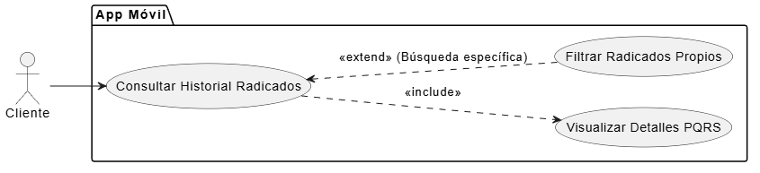

# CU-04: Consultar PQRS Propias

## 1. Descripción
Permite a un Cliente autenticado visualizar el historial de todas las Peticiones, Quejas, Reclamos o Sugerencias (PQRS) que ha radicado a través del sistema, y buscar una solicitud específica utilizando filtros (ej. número de radicado).

## 2. Actores
* **Cliente:** Persona natural que consulta su historial.

## 3. Precondiciones
* El Cliente debe haber iniciado sesión exitosamente en la App Móvil (CU-02).
* El Cliente debe haber radicado al menos una PQRS previamente.

## 4. Flujo Principal (Listado General)
1. El Cliente inicia sesión y accede al panel principal de la App.
2. Selecciona la opción "Mis Radicados".
3. El sistema consulta en la Base de Datos todas las PQRS asociadas al número de identificación del Cliente.
4. El sistema presenta el listado ordenado cronológicamente (más recientes primero).
5. El Cliente visualiza la siguiente información por cada registro: Número de radicado, Fecha, Tipo (PQRS), Comentarios, enlace al Anexo, Estado actual (Nuevo, En proceso, Resuelto, Rechazado) y la Justificación del estado si aplica.

## 5. Flujos Alternativos

*   **Flujo Alternativo 1 (Filtrar por Número de Radicado):**
    1. El Cliente se encuentra en la pantalla "Mis Radicados".
    2. Ingresa un número específico en la barra de búsqueda o filtro "Número de Radicado".
    3. Presiona el botón de buscar.
    4. El sistema realiza una consulta a la BD filtrando el resultado por el identificador ingresado.
    5. El sistema muestra únicamente el registro coincidente, ocultando el resto del historial.
*   **Flujo Excepción 1 (Sin Historial de PQRS):**
    En el paso 3, si la base de datos no arroja resultados, el sistema muestra un mensaje amigable al Cliente: "Aún no tienes radicados registrados en el sistema.", y ofrece un botón de acceso rápido a "Radicar Nueva PQRS".

## 6. Diagrama del Caso de Uso

