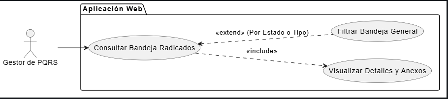

# CU-05: Gestionar Bandeja de Entrada

## 1. Descripción
Proporciona al administrador del sistema (Gestor de PQRS) la funcionalidad para visualizar, desde la Aplicación Web, el listado general de todas las peticiones, quejas, reclamos o sugerencias ingresadas por todos los Clientes, y aplicar filtros avanzados para organizarlas.

## 2. Actores
* **Gestor de PQRS:** Usuario administrativo que atiende las solicitudes de la bandeja.

## 3. Precondiciones
* El Gestor debe estar autenticado (CU-02) con rol de administrador en la Aplicación Web.
* El sistema debe contar con al menos una PQRS registrada en la base de datos para mostrar.

## 4. Flujo Principal (Listado General)
1. El Gestor ingresa a la Aplicación Web y se autentica correctamente.
2. El sistema lo redirige al panel principal (Dashboard).
3. Selecciona la opción "Bandeja de Radicados".
4. El sistema consulta en la Base de Datos todas las PQRS registradas.
5. El sistema presenta el listado general en formato de tabla, mostrando columnas de: Número de radicado, Fecha, Tipo (PQRS), Comentarios, Anexo (PDF), Estado y Justificación.
6. El Gestor puede paginar los resultados si la cantidad excede el límite visible.

## 5. Flujos Alternativos

*   **Flujo Alternativo 1 (Filtrado Combinado):**
    1. El Gestor de PQRS, estando en la Bandeja, visualiza los filtros de "Tipo de radicado" (Petición, Queja, Reclamo, Sugerencia) y "Estado" (Nuevo, En proceso, Resuelto, Rechazado).
    2. El Gestor selecciona uno o ambos filtros combinados.
    3. Hace clic en "Buscar/Filtrar".
    4. El sistema realiza una consulta a la BD aplicando los parámetros seleccionados.
    5. El sistema actualiza la tabla y muestra únicamente los resultados coincidentes.
*   **Flujo Excepción 1 (Sin Resultados para el Filtro):**
    En el paso 4 del Flujo Alternativo 1, si la base de datos no arroja registros coincidentes con los filtros aplicados, la tabla se vacía y muestra el mensaje: "No se encontraron radicados que coincidan con los criterios de búsqueda".

## 6. Diagrama del Caso de Uso

