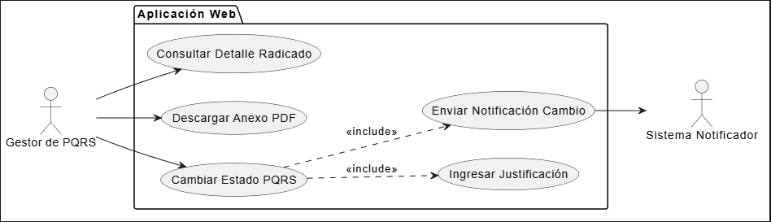

# CU-06: Tramitar PQRS

## 1. Descripción
Permite a un Gestor de PQRS, desde la Aplicación Web, procesar una petición, queja, reclamo o sugerencia específica que ha ingresado a la bandeja. Esto implica descargar el anexo (PDF), actualizar el estado de la solicitud, y justificar la decisión, lo cual desencadena una notificación automática al cliente involucrado.

## 2. Actores
* **Gestor de PQRS:** Actor principal (Administrador) que evalúa y tramita.
* **Sistema (Notificador):** Envía correo electrónico al Cliente confirmando la acción tomada.

## 3. Precondiciones
* El Gestor de PQRS debe estar autenticado en la Aplicación Web.
* El radicado a tramitar no debe encontrarse en estado "Resuelto" o "Rechazado" (estados finales).
* El Gestor debe visualizar la bandeja de radicados (CU-05).

## 4. Flujo Principal (Actualizar Estado y Justificar)
1. El Gestor de PQRS ingresa a la Bandeja de Radicados.
2. Identifica una solicitud en estado "Nuevo".
3. Hace clic sobre la opción "Ver detalle" y el sistema le muestra la información completa del radicado.
4. El Gestor hace clic en el enlace del "Anexo".
5. El sistema descarga o abre el documento PDF adjunto por el Cliente en el momento de la radicación.
6. El Gestor de PQRS analiza el contenido y determina el siguiente paso.
7. El Gestor selecciona la opción "Gestionar Estado".
8. El sistema despliega un menú desplegable con las opciones "Nuevo", "En proceso", "Resuelto" y "Rechazado", junto con un campo de texto obligatorio "Justificación".
9. El Gestor cambia el estado (ej. a "En proceso") y redacta la respuesta/justificación.
10. Hace clic en "Guardar y Notificar".
11. El sistema actualiza el registro en la BD, almacena la justificación y envía un evento al notificador.
12. El Sistema (Notificador) envía un correo electrónico al Cliente informándole sobre la actualización del estado de su radicado e incluye la justificación del gestor.
13. El sistema muestra un mensaje de éxito: "Estado actualizado y cliente notificado".

## 5. Flujos Alternativos

*   **Flujo Excepción 1 (Intento sin Justificación):**
    En el paso 9, si el Gestor intenta actualizar a un estado distinto de "Nuevo" (como "Rechazado" o "Resuelto") pero deja en blanco el campo "Justificación", el sistema no le permite avanzar, marcando el campo en rojo con la advertencia: "La justificación es obligatoria para cambiar el estado."
*   **Flujo Excepción 2 (Falla al enviar correo):**
    En el paso 12, si el SMTP o el API de envío falla, el sistema guarda el nuevo estado pero registra el error de notificación en los logs (y notifica al administrador: "Cambio de estado guardado, pero no se pudo enviar el correo de confirmación al cliente").

## 6. Diagrama del Caso de Uso

