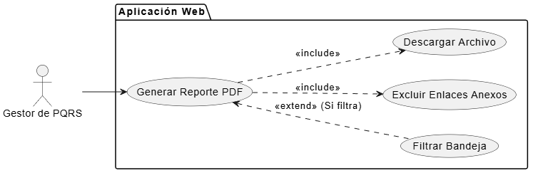

# CU-07: Generar Reportes

## 1. Descripción
Permite al Gestor de PQRS, desde la Aplicación Web, exportar el listado de peticiones, quejas, reclamos y sugerencias consultadas o filtradas a un documento PDF. Este reporte sirve como registro y soporte de la gestión realizada, excluyendo información innecesaria como los enlaces a los anexos.

## 2. Actores
* **Gestor de PQRS:** Usuario administrativo que solicita la exportación.

## 3. Precondiciones
* El Gestor de PQRS debe estar autenticado en la Aplicación Web (CU-02).
* El Gestor debe encontrarse en la interfaz "Bandeja de Radicados" (CU-05).
* La tabla de resultados debe contener al menos un registro (filtrado o general) para exportar.

## 4. Flujo Principal (Generar Reporte de Bandeja)
1. El Gestor de PQRS se encuentra visualizando la Bandeja General con todos los radicados.
2. Hace clic en el botón "Generar Reporte PDF".
3. El sistema compila la información visible en la tabla de resultados (Número de Radicado, Fecha, Tipo, Comentarios, Estado, Justificación).
4. El sistema excluye la columna de enlaces a los Anexos.
5. El sistema utiliza una librería interna de generación PDF (ej. iText, JasperReports) y procesa los datos en un formato estructurado.
6. El navegador descarga automáticamente el archivo PDF generado en el dispositivo local del Gestor.

## 5. Flujos Alternativos

*   **Flujo Alternativo 1 (Reporte con Filtros Aplicados):**
    1. El Gestor aplica un filtro en la bandeja (ej. Estado "En proceso" o Tipo "Queja") según el CU-05.
    2. La tabla muestra los resultados restringidos por los filtros.
    3. Al hacer clic en "Generar Reporte PDF", el sistema procesa **únicamente** los registros que cumplen las condiciones del filtro en ese momento.
    4. Se genera el documento PDF, cuyo encabezado o subtítulo puede indicar los criterios filtrados (ej. "Reporte de Radicados - Quejas en Estado 'En Proceso'").
*   **Flujo Excepción 1 (Bandeja Vacía):**
    Si el Gestor aplica filtros que no devuelven resultados (la tabla está vacía) y hace clic en "Generar Reporte PDF", el sistema bloquea la acción o muestra una advertencia: "No hay registros disponibles para exportar con los filtros actuales."

## 6. Diagrama del Caso de Uso

