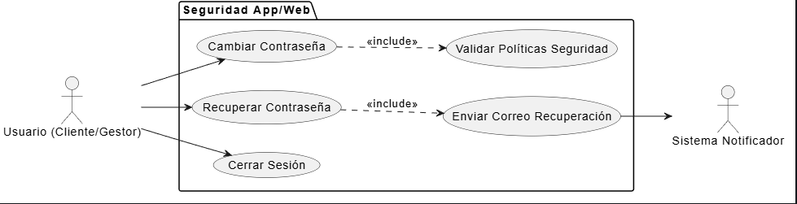

# CU-08: Gestionar Seguridad de la Cuenta

## 1. Descripción
Permite a los usuarios (Cliente o Gestor) administrar las credenciales de acceso a sus cuentas, brindándoles opciones para recuperar una contraseña olvidada, cambiar la contraseña autogenerada por una de su preferencia, y cerrar sesión de manera segura. Estas funcionalidades (HU-13, HU-14, HU-15) fueron identificadas como complementos vitales para la seguridad del MVP.

## 2. Actores
* **Cliente:** Actor que administra su acceso desde la App Móvil o Web.
* **Gestor de PQRS:** Actor que administra su acceso desde la Aplicación Web.
* **Sistema (Notificador):** Actor encargado de enviar el correo electrónico de recuperación de contraseña.

## 3. Precondiciones
* Para *Cambiar Contraseña* y *Cerrar Sesión*, el usuario debe estar autenticado en el sistema (CU-02).
* Para *Recuperar Contraseña*, el usuario debe estar registrado en el sistema pero no autenticado.

## 4. Flujo Principal (Cambiar Contraseña)
1. El usuario (Cliente o Gestor) inicia sesión exitosamente en la App o Aplicación Web.
2. Accede a la opción "Mi Perfil" o "Configuración de Cuenta".
3. Selecciona la opción "Cambiar Contraseña".
4. El sistema despliega un formulario con tres campos: "Contraseña Actual", "Nueva Contraseña" y "Confirmar Nueva Contraseña".
5. El usuario diligencia los tres campos.
6. El sistema verifica que la contraseña actual sea correcta (comparando el hash con la BD).
7. El sistema verifica que la nueva contraseña cumpla con las políticas de seguridad (mínimo 6 caracteres, 1 mayúscula, 1 minúscula, 1 número) y coincida con el campo de confirmación.
8. El sistema cifra y actualiza la nueva contraseña en la base de datos.
9. El sistema muestra un mensaje de éxito: "Su contraseña ha sido actualizada correctamente".

## 5. Flujos Alternativos

*   **Flujo Alternativo 1 (Recuperar Contraseña Olvidada):**
    1. El usuario, desde la pantalla de Login, selecciona "Olvidé mi contraseña".
    2. El sistema solicita el "Número de Identificación" o "Correo Electrónico".
    3. El usuario ingresa el dato y presiona "Recuperar".
    4. El sistema busca al usuario en la BD. Si existe, genera un token temporal o una nueva contraseña autogenerada (como en el CU-01).
    5. El Sistema Notificador envía un correo electrónico al usuario con las instrucciones o la nueva credencial.
    6. El sistema informa en pantalla: "Se han enviado instrucciones a su correo electrónico registrado."
*   **Flujo Alternativo 2 (Cerrar Sesión):**
    1. El usuario (Cliente o Gestor), estando autenticado, hace clic en "Cerrar Sesión" o "Salir" desde el menú principal de la App/Web.
    2. El sistema invalida el token de sesión actual (o la cookie).
    3. El sistema redirige al usuario a la pantalla pública de Login o inicio.
*   **Flujo Excepción 1 (Contraseñas no coinciden al cambiar):**
    En el paso 7 del flujo principal, si la "Nueva Contraseña" y "Confirmar Nueva Contraseña" son diferentes, o no cumplen las políticas de complejidad (ej. muy corta, sin mayúscula), el sistema impide el cambio y muestra: "Las contraseñas no coinciden o no cumplen los requisitos de seguridad (mín. 6 caracteres, 1 mayúscula, 1 minúscula, 1 número)."

## 6. Diagrama del Caso de Uso

