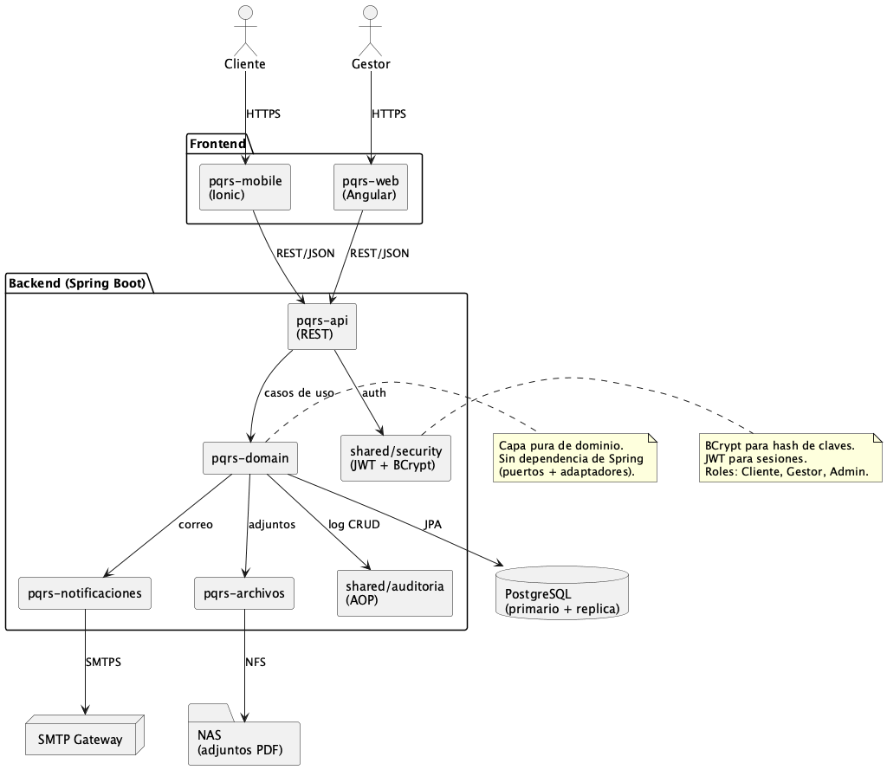

# 3. Vista lógica

La vista lógica describe la descomposicion del sistema en componentes desde una perspectiva estatica de responsabilidades.

## 3.1 Contenedores principales

### Frontend

Dos aplicaciones que comparten infraestructura comun (servicios, modelos, theming) pero exponen interfaces distintas:

- pqrs-frontend-mobile: aplicacion del Cliente. Tecnologias: Angular 20 mas Ionic 8 mas Capacitor. Diseño mobile-first. Se distribuye como PWA por defecto y es compilable a nativo Android e iOS.
- pqrs-frontend-web: aplicacion del Gestor. Tecnologias: Angular 20 mas Ionic 8 mas Tailwind CSS. Diseño pensado para resoluciones desktop, con layout sidebar mas tabla central mas dashboard.

### Backend

- pqrs-api: capa de controllers REST. Punto de entrada HTTP del backend. Valida contratos JSON, delega al dominio.
- pqrs-domain: entidades de dominio y reglas de negocio puras. Sin dependencia de Spring. Define interfaces (puertos) que la infraestructura implementa.
- pqrs-notificaciónes: cliente del servidor SMTP. Plantillas de correo para radicación, cambios de estado y contraseñas autogeneradas. Envio asíncrono via @Async o eventos de dominio.
- pqrs-archivos: adaptador del NAS / FileSystem. Guarda y recupera los PDF adjuntos.
- shared/security: módulo de seguridad. Spring Security mas JWT mas BCrypt. Define roles cliente, gestor y admin.
- shared/auditoría: aspecto AOP que registra cada operación CRUD del dominio (que acción, que usuario, cuando).
- shared/logging: configuracion de Logback estructurada. Captura y persiste errores con stack trace y contexto.

### Infraestructura externa

- PostgreSQL primario mas replica standby (failover manual + backup diario).
- NAS o FileSystem para los PDF adjuntos.
- SMTP Gateway (Postfix on-premise, AWS SES o equivalente).

## 3.2 descripción de capas del backend

| Capa | Responsabilidad |
|---|---|
| API REST | Endpoints HTTP. Valida payload JSON, autentica via JWT, delega al dominio. |
| Dominio (puerto) | Casos de uso del negocio: radicar, tramitar, autenticar, generar reporte. Sin dependencia de Spring. |
| Persistencia (adaptador) | Implementacion JPA de los puertos del dominio. Gestiona transacciones y mapeo objeto-relacional. |
| Integraciones (adaptador) | Implementacion de clientes externos: email, NAS, generador PDF. |
| Cross-cutting (shared) | Security, auditoría, Logging. Se aplican via interceptores Spring y aspectos AOP. |

## 3.3 especificación de clases (cobertura entregable opcional)

Nota: esta vista de desarrollo cubre tambien el entregable opcional especificación de Clases. La estructura de paquetes Java y los componentes Angular descritos en la Vista de Desarrollo (sección 5) constituyen la especificación de clases del sistema. No se genera un diagrama UML de clases separado para evitar redundancia con la vista hexagonal.

## 3.4 Diagramas

El diagrama de la vista lógica vive en el archivo PlantUML `diagramas/arquitectura/2-vista-lógica.puml` del repositorio.
