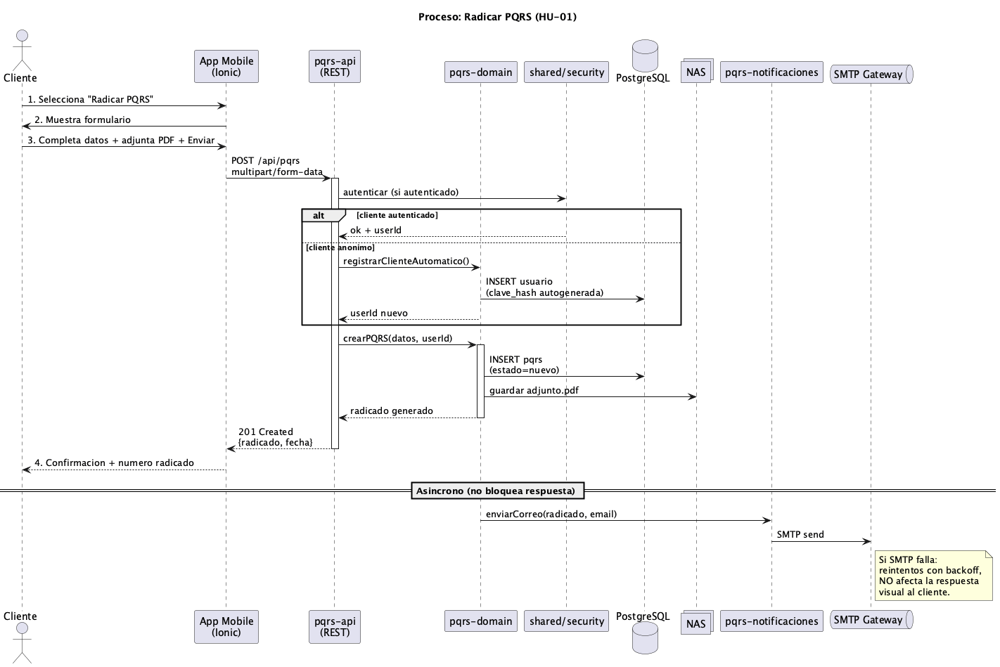
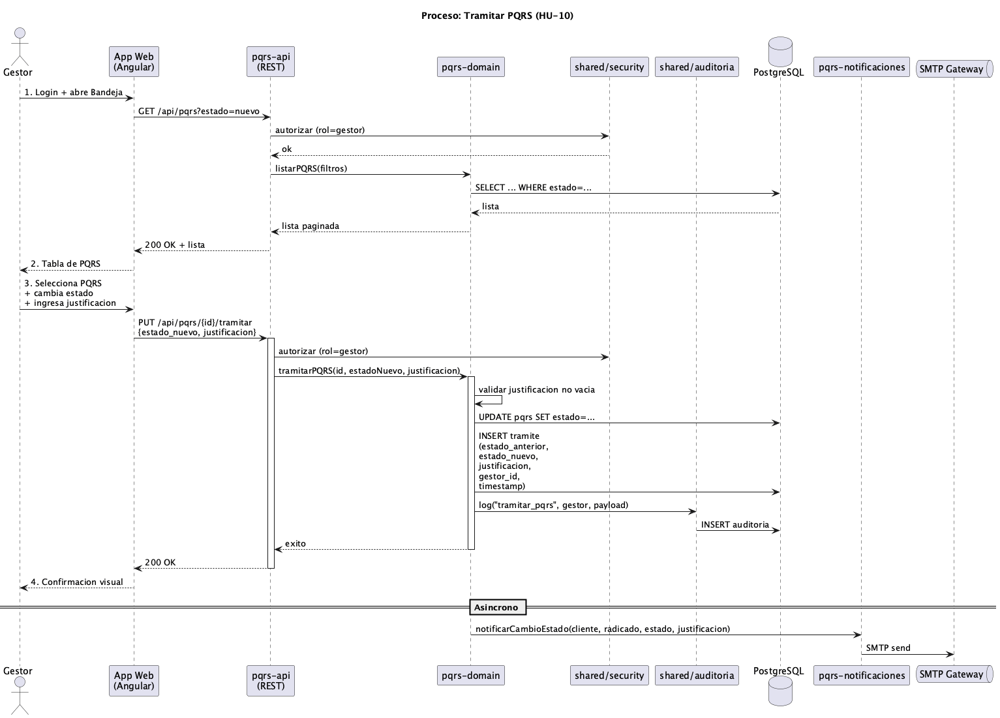
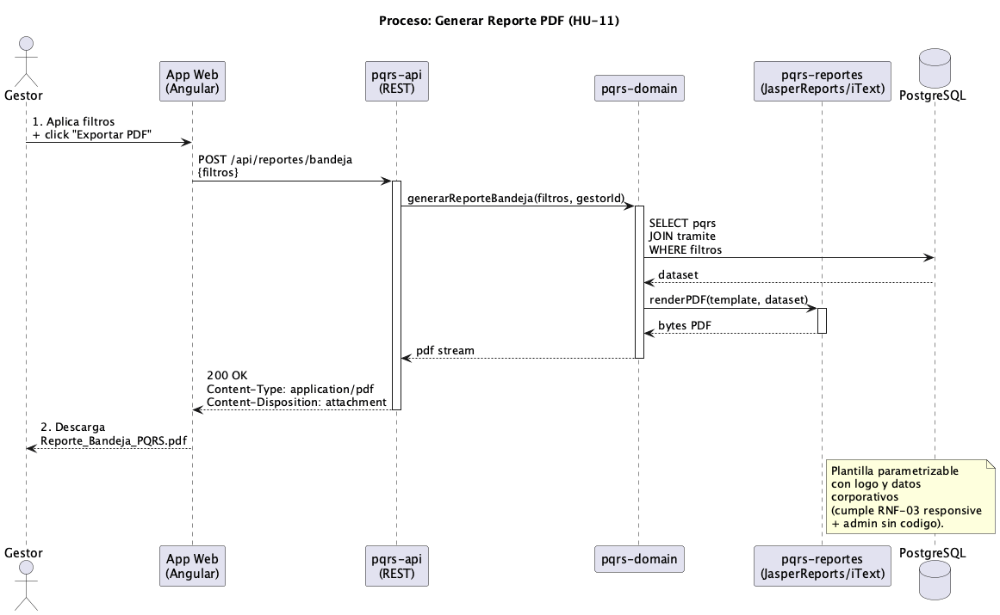

# 4. Vista de Procesos

La vista de procesos describe el comportamiento dinámico del sistema en tiempo de ejecución: secuencias entre componentes, interacciónes entre actores y mecanismos asíncronos.

## 4.1 Proceso: Radicar PQRS

Flujo principal:

- El Cliente envía el formulario con datos y PDF adjunto via POST /api/pqrs (multipart/form-data).
- Si el Cliente esta autenticado: shared/security valida el JWT y resuelve el userId.
- Si el Cliente esta anónimo: el dominio crea un usuario automático con clave aleatoria, cifrada con BCrypt (CU-01).
- El PDF se persiste en NAS mediante el adapter pqrs-archivos. En BD solo queda la metadata (ruta, tamaño, mime).
- Se genera el numero de radicado con formato PQRS-YYYY-NNNNNN y se persiste la PQRS con estado nuevo.
- La respuesta 201 Created se devuelve inmediatamente al cliente con el numero de radicado y la fecha.

Rama asíncrona (no bloquea la respuesta UI):

- pqrs-notificaciónes envía un correo al cliente con el numero de radicado y, si fue cliente nuevo, la clave autogenerada.
- Si el SMTP falla, el sistema reintenta con backoff usando la tabla notificación como cola.

## 4.2 Proceso: Tramitar PQRS

Flujo principal:

- El Gestor abre la Bandeja con filtros opcionales: GET /api/pqrs?estado=nuevo.
- shared/security valida que el rol del usuario sea gestor.
- El dominio consulta el repositorio y devuelve una lista paginada.
- El Gestor selecciona una PQRS, cambia su estado e ingresa la justificación (obligatoria).
- PUT /api/pqrs/{id}/tramitar envía el cambio.
- El dominio valida que la justificación no este vacia y actualiza pqrs.estado.
- Se inserta un registro en la tabla trámite con estado_anterior, estado_nuevo, justificación, gestor_id y timestamp.
- shared/auditoría (AOP) registra la operación en la tabla auditoría.

Rama asíncrona:

- pqrs-notificaciónes avisa al cliente del cambio de estado con la justificación.

## 4.3 Proceso: Generar Reporte PDF

Flujo principal:

- El Gestor aplica filtros opcionales sobre la bandeja y hace click en Exportar PDF.
- POST /api/reportes/bandeja envía los filtros aplicados.
- El dominio consulta las PQRS con join a trámite para incluir la justificación del estado actual.
- Se invoca el adapter pqrs-reportes (JasperReports o iText) con la plantilla y el dataset.
- La respuesta lleva Content-Type application/pdf y Content-Disposition attachment, forzando la descarga directa en el navegador del Gestor.

La plantilla del PDF es parametrizable: logo, colores y nombre corporativo se cargan desde la BD, permitiendo cambios sin recompilar el código.
