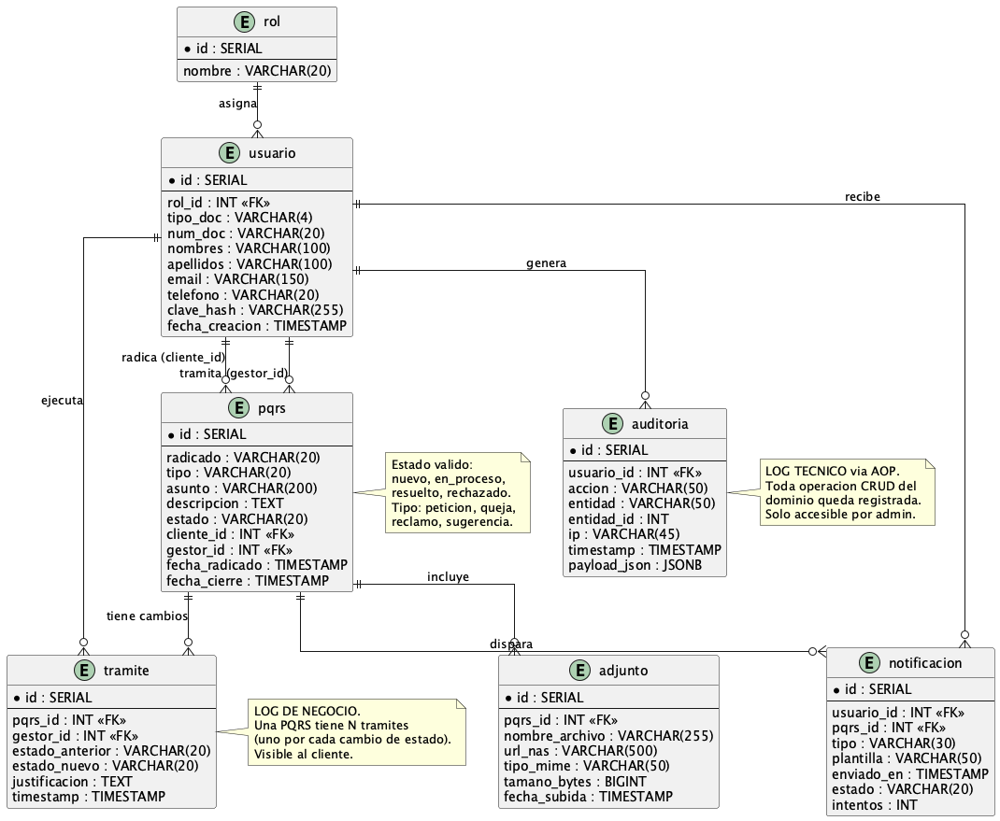

# 8. Modelo Entidad-Relación (Diccionario de Datos)

> Esta sección embebe el modelo entidad-relación detallado del sistema PQRS. Sirve también como **Diccionario de Datos** (entregable opcional #15) y como **Modelo Conceptual** (entregable opcional #13), ya que las entidades aquí definidas representan los conceptos del dominio a nivel abstracto, además del nivel relacional. La sección 7 (Vista de Datos) presenta el resumen ejecutivo del modelo; esta sección 8 contiene el detalle completo.

## 8.1 Diagrama MER

## 8.2  Entidades y relaciónes

### 8.2.1 Listado de entidades

| Entidad | Propósito |
|---|---|
| `usuario` | Centraliza Cliente, Gestor y Admin. Discriminado por el atributo `rol` (CHECK enum, no tabla separada). |
| `pqrs` | Cabecera de cada radicado. Estado actual + metadata. |
| `trámite` | Log de negocio: cada cambio de estado de una PQRS. |
| `adjunto` | Metadata del PDF anexado. El archivo binario vive en NAS. |
| `notificación` | Cola de correos transaccionales. |
| `auditoría` | Log técnico vía AOP. Toda operación CRUD del dominio. |

> **Nota sobre roles:** los roles del sistema (`cliente`, `gestor`, `admin`) se modelan como un CHECK constraint sobre `usuario.rol`, no como tabla catálogo separada. Decisión tomada para reducir joins en queries frecuentes (bandeja, autorización) y porque el conjunto de roles es cerrado y conocido de antemano. Cambios en el conjunto requieren migración Flyway, no escritura en runtime.

### 8.2.2 Relaciónes principales

| De | A | Cardinalidad | Significado |
|---|---|---|---|
| `usuario` | `pqrs` (cliente_id) | 1—N | Un cliente puede radicar varias PQRS. |
| `usuario` | `pqrs` (gestor_id) | 1—N (nullable) | Un gestor tramita varias PQRS. El `gestor_id` es nullable porque al radicar la PQRS aún no está asignada. |
| `usuario` | `trámite` (gestor_id) | 1—N | Un gestor ejecuta varios trámites. |
| `pqrs` | `trámite` | 1—N | Una PQRS pasa por varios cambios de estado (nuevo → en_proceso → resuelto → posible reapertura). Cada cambio es un trámite. |
| `pqrs` | `adjunto` | 1—N | Una PQRS puede tener varios archivos anexos. |
| `pqrs` | `notificación` | 1—N | Una PQRS dispara varios correos (radicación, cambios de estado). |
| `usuario` | `notificación` | 1—N | Un usuario recibe varios correos. |
| `usuario` | `auditoría` | 1—N | Un usuario genera N entradas de auditoría a lo largo del tiempo. |

### 8.2.3 Diferencia entre `trámite` y `auditoría`

Tabla `trámite` = log de **negocio**. Visible al cliente. Lo escribe el dominio explícitamente cuando un Gestor cambia el estado de la PQRS. Sirve para que el cliente entienda el ciclo de vida (paso a `en_proceso` con tal justificación, paso a `resuelto` con tal otra).

Tabla `auditoría` = log **técnico**. Interno. Se genera automáticamente por AOP en TODA operación CRUD del dominio. Sirve para investigaciones forenses, debugging y compliance.

No son redundantes. Cumplen roles ortogonales: uno es para el cliente, otro es para el operador del sistema.

---

## 8.3  Constraints e índices

### 8.3.1 Constraints UNIQUE

| Entidad | Columna | Constraint | Descripción |
|---|---|---|---|
| `usuario` | `email` | UNIQUE | No pueden existir dos usuarios con el mismo email. |
| `usuario` | `num_doc` | UNIQUE | No pueden existir dos usuarios con el mismo documento. |
| `pqrs` | `radicado` | UNIQUE | Número de radicado único (`PQRS-YYYY-NNNNNN`). |

### 8.3.2 Constraints CHECK

| Entidad | Columna | Regla | Descripción |
|---|---|---|---|
| `usuario` | `tipo_doc` | `IN ('CC', 'CE', 'TI', 'PP')` | Tipos de documento válidos. |
| `usuario` | `rol` | `IN ('cliente', 'gestor', 'admin')` | Roles del sistema. |
| `pqrs` | `tipo` | `IN ('peticion', 'queja', 'reclamo', 'sugerencia')` | Tipos de PQRS. |
| `pqrs` | `estado` | `IN ('nuevo', 'en_proceso', 'resuelto', 'rechazado')` | Estados de la PQRS. |
| `adjunto` | `tipo_mime` | `= 'application/pdf'` | Solo PDF permitidos. |
| `adjunto` | `tamano_bytes` | `<= 5242880` | Límite máximo de 5 MB. |

### 8.3.3 Índices recomendados

Optimizan las queries más frecuentes del backend (bandeja, historial, notificaciónes pendientes):

- `idx_pqrs_estado` sobre `pqrs(estado)` — filtros de Bandeja.
- `idx_pqrs_cliente` sobre `pqrs(cliente_id, fecha_radicado DESC)` — historial del cliente.
- `idx_pqrs_gestor` sobre `pqrs(gestor_id)` — asignación gestor.
- `idx_tramite_pqrs` sobre `trámite(pqrs_id, timestamp DESC)` — historial de cambios de una PQRS.
- `idx_notificacion_estado` sobre `notificación(estado)` — retry de correos pendientes.
- `idx_auditoria_usuario` sobre `auditoría(usuario_id, timestamp DESC)` — forensics.

---

## 8.4  Diccionario de Datos

> Esta sección cubre el entregable opcional **#15 Diccionario de Datos**. Especifica cada columna del modelo: tipo SQL, nulabilidad, descripción, ejemplo y validaciones.

### 8.4.1 Tabla `usuario`

| Columna | Tipo SQL | Null | Descripción | Ejemplo | Validaciones |
|---|---|---|---|---|---|
| id | SERIAL | NO | PK auto-incremental | 42 | Generado por la BD |
| rol | VARCHAR(20) | NO | Rol del usuario | "cliente" | CHECK IN ('cliente','gestor','admin') |
| tipo_doc | VARCHAR(4) | NO | Tipo de documento | "CC" | IN ('CC','CE','TI','PP') |
| num_doc | VARCHAR(20) | NO | Número de documento | "1020304050" | UNIQUE, solo dígitos para CC/TI, alfanumérico para PP |
| nombres | VARCHAR(100) | NO | Nombres del usuario | "Juan Carlos" | Longitud 2..100 |
| apellidos | VARCHAR(100) | NO | Apellidos | "Perez Lopez" | Longitud 2..100 |
| email | VARCHAR(150) | NO | Correo electrónico | "jcperez@gmail.com" | UNIQUE, regex RFC 5322 simplificado |
| telefono | VARCHAR(20) | YES | Teléfono móvil | "3001234567" | Solo dígitos, 10..15 caracteres |
| clave_hash | VARCHAR(255) | NO | Hash BCrypt de la clave | "$2a$12$..." | BCrypt cost 12 |
| fecha_creacion | TIMESTAMP | NO | Timestamp de alta | "2026-05-15 10:00:00" | DEFAULT NOW() |

### 8.4.2 Tabla `pqrs`

| Columna | Tipo SQL | Null | Descripción | Ejemplo | Validaciones |
|---|---|---|---|---|---|
| id | SERIAL | NO | PK auto-incremental | 100 | Generado por la BD |
| radicado | VARCHAR(20) | NO | Número público del radicado | "PQRS-2026-000123" | UNIQUE, formato `PQRS-YYYY-NNNNNN` |
| tipo | VARCHAR(20) | NO | Categoría de la PQRS | "queja" | IN ('peticion','queja','reclamo','sugerencia') |
| asunto | VARCHAR(200) | NO | Asunto corto | "Producto vencido" | Longitud 5..200 |
| descripción | TEXT | NO | Descripción detallada | "El producto X..." | Longitud mínima 20 caracteres |
| estado | VARCHAR(20) | NO | Estado actual | "nuevo" | IN ('nuevo','en_proceso','resuelto','rechazado'), DEFAULT 'nuevo' |
| cliente_id | INT | NO | FK al usuario que radicó | 42 | REFERENCES usuario(id), rol cliente |
| gestor_id | INT | YES | FK al gestor asignado | 5 | REFERENCES usuario(id), rol gestor, nullable hasta asignación |
| fecha_radicado | TIMESTAMP | NO | Fecha de radicación | "2026-05-15 10:05:00" | DEFAULT NOW() |
| fecha_cierre | TIMESTAMP | YES | Fecha de cierre (si aplica) | "2026-05-20 16:30:00" | Solo si estado IN ('resuelto','rechazado') |

### 8.4.3 Tabla `trámite`

| Columna | Tipo SQL | Null | Descripción | Ejemplo | Validaciones |
|---|---|---|---|---|---|
| id | SERIAL | NO | PK | 200 | Generado por la BD |
| pqrs_id | INT | NO | FK a la PQRS | 100 | REFERENCES pqrs(id) |
| gestor_id | INT | NO | Gestor que ejecuta el cambio | 5 | REFERENCES usuario(id), rol gestor |
| estado_anterior | VARCHAR(20) | NO | Estado antes del cambio | "nuevo" | IN ('nuevo','en_proceso','resuelto','rechazado') |
| estado_nuevo | VARCHAR(20) | NO | Estado después del cambio | "en_proceso" | IN ('nuevo','en_proceso','resuelto','rechazado') |
| justificación | TEXT | NO | Razón del cambio | "Se inicia investigación..." | Longitud mínima 10 caracteres, no solo espacios |
| timestamp | TIMESTAMP | NO | Fecha del cambio | "2026-05-15 11:00:00" | DEFAULT NOW() |

### 8.4.4 Tabla `adjunto`

| Columna | Tipo SQL | Null | Descripción | Ejemplo | Validaciones |
|---|---|---|---|---|---|
| id | SERIAL | NO | PK | 300 | Generado por la BD |
| pqrs_id | INT | NO | FK a la PQRS | 100 | REFERENCES pqrs(id) ON DELETE CASCADE |
| nombre_archivo | VARCHAR(255) | NO | Nombre original | "factura.pdf" | Longitud 1..255 |
| url_nas | VARCHAR(500) | NO | Ruta en NAS | "/nas/pqrs/2026/05/PQRS-2026-000123-001.pdf" | Path válido |
| tipo_mime | VARCHAR(50) | NO | Tipo MIME | "application/pdf" | Solo `application/pdf` |
| tamano_bytes | BIGINT | NO | Tamaño en bytes | 102400 | <= 5242880 (5 MB) |
| fecha_subida | TIMESTAMP | NO | Fecha de subida | "2026-05-15 10:05:30" | DEFAULT NOW() |

### 8.4.5 Tabla `notificación`

| Columna | Tipo SQL | Null | Descripción | Ejemplo | Validaciones |
|---|---|---|---|---|---|
| id | SERIAL | NO | PK | 400 | Generado por la BD |
| usuario_id | INT | NO | Destinatario | 42 | REFERENCES usuario(id) |
| pqrs_id | INT | YES | PQRS relacionada (si aplica) | 100 | REFERENCES pqrs(id) |
| tipo | VARCHAR(30) | NO | Tipo de notificación | "radicado_creado" | IN ('radicado_creado','cambio_estado','clave_autogenerada','recordatorio') |
| plantilla | VARCHAR(50) | NO | Identificador de plantilla | "email_radicado_es" | Existe en `pqrs-notificaciónes` |
| enviado_en | TIMESTAMP | YES | Fecha de envío exitoso | "2026-05-15 10:05:35" | NULL si aún no enviada |
| estado | VARCHAR(20) | NO | Estado del envío | "enviada" | IN ('pendiente','enviada','fallida') |
| intentos | INT | NO | Número de reintentos | 0 | DEFAULT 0, max 5 |

### 8.4.6 Tabla `auditoría`

| Columna | Tipo SQL | Null | Descripción | Ejemplo | Validaciones |
|---|---|---|---|---|---|
| id | SERIAL | NO | PK | 500 | Generado por la BD |
| usuario_id | INT | YES | Usuario que ejecutó la acción | 5 | REFERENCES usuario(id), nullable si fue sistema |
| acción | VARCHAR(50) | NO | Tipo de acción | "tramitar_pqrs" | Vocabulario controlado por AOP aspect |
| entidad | VARCHAR(50) | NO | Tabla afectada | "pqrs" | Nombre de tabla del sistema |
| entidad_id | INT | NO | ID de la fila afectada | 100 | FK soft (no enforced) |
| ip | VARCHAR(45) | YES | IP del cliente | "192.168.1.10" | IPv4 o IPv6 |
| timestamp | TIMESTAMP | NO | Fecha de la acción | "2026-05-15 11:00:00" | DEFAULT NOW() |
| payload_json | JSONB | YES | Snapshot del cambio | `{"estado_anterior":"nuevo","estado_nuevo":"en_proceso"}` | JSON válido |

