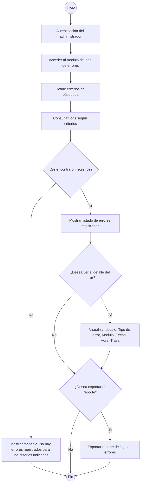

# Diagrama de Actividades - Consulta logs

```mermaid
flowchart TD

    A((Inicio)) --> B[Autenticación del administrador]
    B --> C[Acceder al módulo de logs de errores]
    C --> D[Definir criterios de búsqueda]
    D --> E[Consultar logs según criterios]
    E --> F{¿Se encontraron registros?}
    F -->|No| G[Mostrar mensaje: No hay errores registrados para los criterios indicados]
    F -->|Sí| H[Mostrar listado de errores registrados]
    G --> I((Fin))
    H --> J{¿Desea ver el detalle del error?}
    J -->|Sí| K[Visualizar detalle: Tipo de error, Módulo, Fecha, Hora, Traza]
    J -->|No| L{¿Desea exportar el reporte?}
    K --> L
    L -->|Sí| M[Exportar reporte de logs de errores]
    L -->|No| I
    M --> I

```
