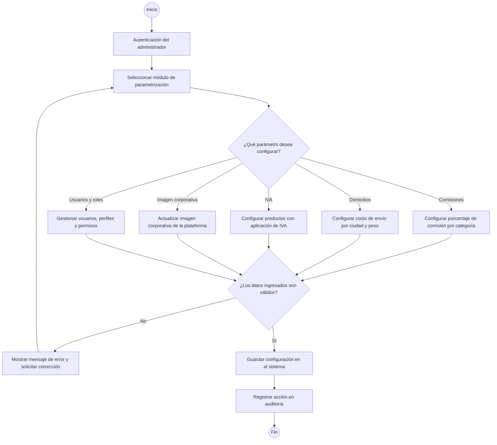

# Diagrama de Actividades - Gestión parametrización

```mermaid
flowchart TD


    A((Inicio)) --> B[Autenticación del administrador]
    B --> C[Seleccionar módulo de parametrización]
    C --> D{¿Qué parámetro desea configurar?}
    D -->|Comisiones| E[Configurar porcentaje de comisión por categoría]
    D -->|Domicilios| F[Configurar costo de envío por ciudad y peso]
    D -->|IVA| G[Configurar productos con aplicación de IVA]
    D -->|Imagen corporativa| H[Actualizar imagen corporativa de la plataforma]
    D -->|Usuarios y roles| I[Gestionar usuarios, perfiles y permisos]
    E --> J{¿Los datos ingresados son válidos?}
    F --> J
    G --> J
    H --> J
    I --> J
    J -->|No| K[Mostrar mensaje de error y solicitar corrección]
    K --> C
    J -->|Sí| L[Guardar configuración en el sistema]
    L --> M[Registrar acción en auditoría]
    M --> N((Fin))
```
