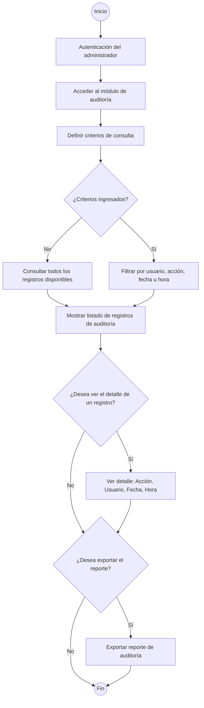

# Diagrama de Actividades - Monitoreo auditoria

## Contexto: E-Commerce Administrador Konrad

```mermaid
flowchart TD
    A((Inicio)) --> B[Autenticación del administrador]
    B --> C[Acceder al módulo de auditoría]
    C --> D[Definir criterios de consulta]
    D --> E{¿Criterios ingresados?}
    E -->|No| F[Consultar todos los registros disponibles]
    E -->|Sí| G[Filtrar por usuario, acción, fecha u hora]
    F --> H[Mostrar listado de registros de auditoría]
    G --> H
    H --> I{¿Desea ver el detalle de un registro?}
    I -->|Sí| J[Ver detalle: Acción, Usuario, Fecha, Hora]
    I -->|No| K{¿Desea exportar el reporte?}
    J --> K
    K -->|Sí| L[Exportar reporte de auditoría]
    K -->|No| M((Fin))
    L --> M
```