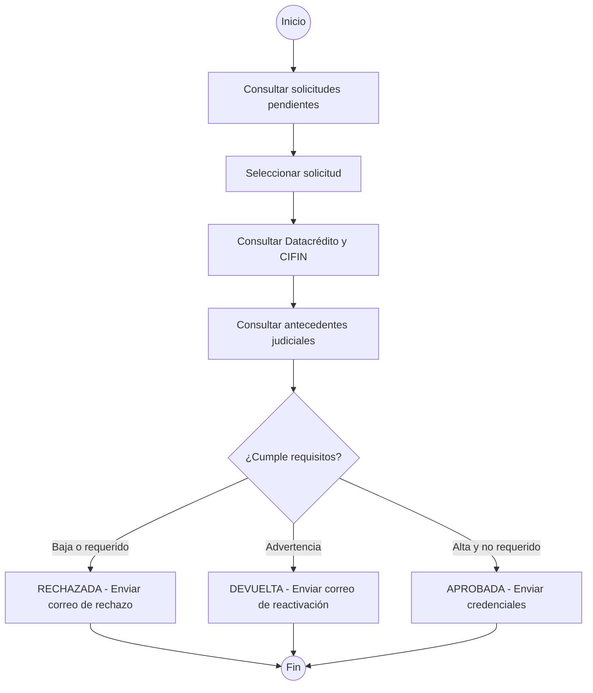

# Diagrama de Actividades - Aprobación de Solicitud de Vendedor

```mermaid
flowchart TD
    A((Inicio)) --> B[Consultar solicitudes pendientes]
    B --> C[Seleccionar solicitud]
    C --> D[Consultar Datacrédito y CIFIN]
    D --> E[Consultar antecedentes judiciales]
    E --> F{¿Cumple requisitos?}
    F -->|Baja o requerido| G[RECHAZADA - Enviar correo de rechazo]
    F -->|Advertencia| H[DEVUELTA - Enviar correo de reactivación]
    F -->|Alta y no requerido| I[APROBADA - Enviar credenciales]
    G --> J((Fin))
    H --> J
    I --> J
```
