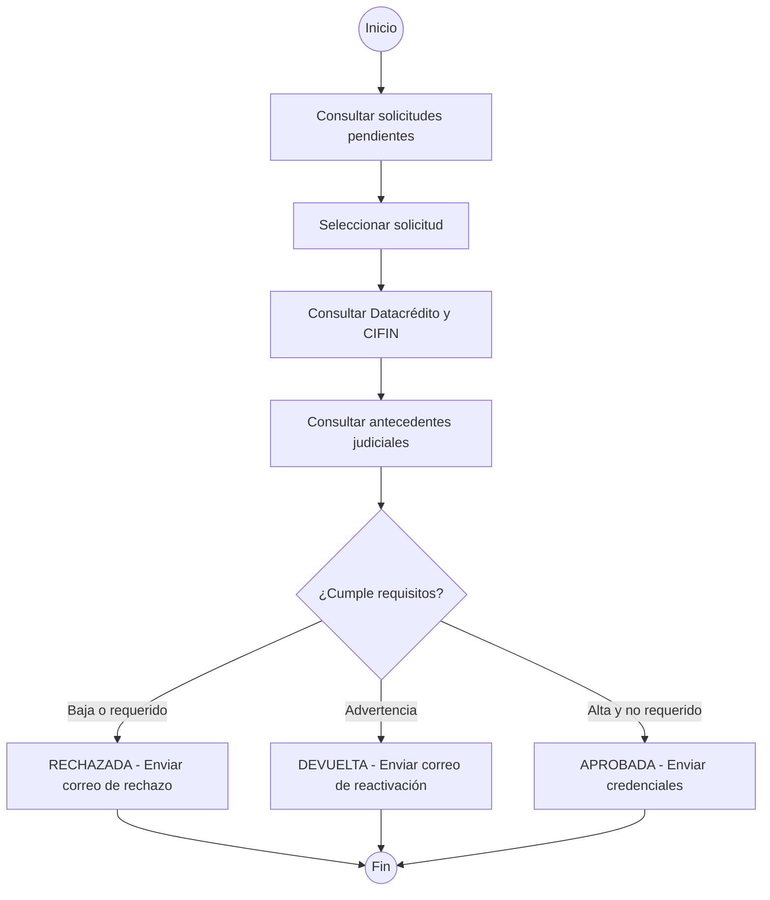

# Diagrama de Actividades - Aprobación de Solicitud de Vendedor

## Contexto: E-Commerce Comercial Konrad

## Reglas de Decisión

| Estado        | Condición                                                     |
| ------------- | ------------------------------------------------------------- |
| **RECHAZADA** | Crediticia Baja en alguna entidad o requerido por la justicia |
| **DEVUELTA**  | Crediticia en Advertencia (sin ser Baja ni requerido)         |
| **APROBADA**  | Crediticia Alta en ambas entidades y no requerido             |

## Listado de Actividades

| #   | Actividad                                                           |
| --- | ------------------------------------------------------------------- |
| 1   | Consultar solicitudes pendientes por criterios de búsqueda          |
| 2   | Seleccionar solicitud y ver detalle                                 |
| 3   | Consultar vida crediticia en Datacrédito y CIFIN                    |
| 4   | Consultar antecedentes judiciales en Policía Nacional               |
| 5   | Evaluar criterios y definir estado (Aprobada, Rechazada o Devuelta) |
| 6   | Enviar correo con el resultado al solicitante                       |
