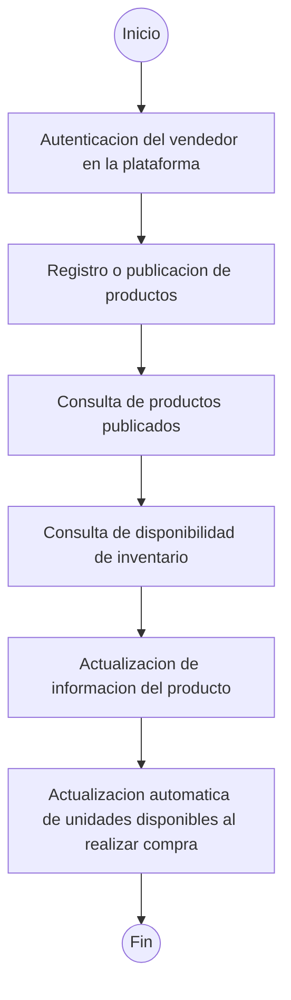

# Diagrama de Actividades - Gestión de Inventario

## Contexto: E-Commerce Comercial Konrad

Este diagrama representa el flujo secuencial de actividades del módulo de gestión de inventario para vendedores.

## Listado de Actividades

| # | Actividad | Descripción |
|---|-----------|-------------|
| 1 | Autenticación del vendedor | El vendedor ingresa credenciales para acceder a la plataforma |
| 2 | Registro/Publicación de productos | Crear nuevos productos con información, imágenes y precios |
| 3 | Consulta de productos publicados | Visualizar catálogo de productos propios |
| 4 | Consulta de disponibilidad | Verificar stock actual de cada producto |
| 5 | Actualización de información | Modificar datos, precios o descripciones del producto |
| 6 | Actualización automática de stock | El sistema descuenta unidades cuando se confirma una compra |
