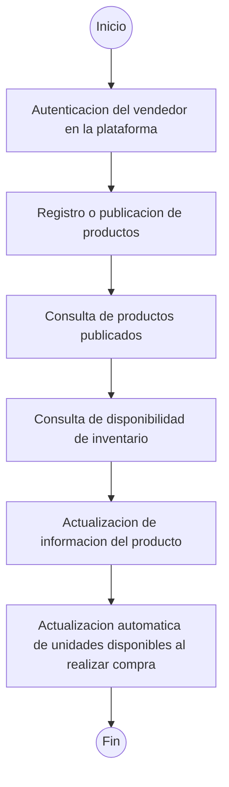

# Diagrama de Actividades - Gestión de Inventario

Este diagrama representa el flujo secuencial de actividades del módulo de gestión de inventario para vendedores.

```mermaid
flowchart TD
    A((Inicio)) --> B[Autenticacion del vendedor en la plataforma]
    B --> C[Registro o publicacion de productos]
    C --> D[Consulta de productos publicados]
    D --> E[Consulta de disponibilidad de inventario]
    E --> F[Actualizacion de informacion del producto]
    F --> G[Actualizacion automatica de unidades disponibles al realizar compra]
    G --> H((Fin))
```
