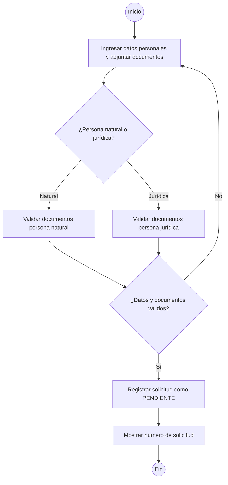

# Diagrama de Actividades - Registro de Vendedor

```mermaid
flowchart TD
    A((Inicio)) --> B[Ingresar datos personales y adjuntar documentos]
    B --> C{¿Persona natural o jurídica?}
    C -->|Natural| D[Validar documentos persona natural]
    C -->|Jurídica| E[Validar documentos persona jurídica]
    D --> F{¿Datos y documentos válidos?}
    E --> F
    F -->|No| B
    F -->|Sí| G[Registrar solicitud como PENDIENTE]
    G --> H[Mostrar número de solicitud]
    H --> I((Fin))
```
