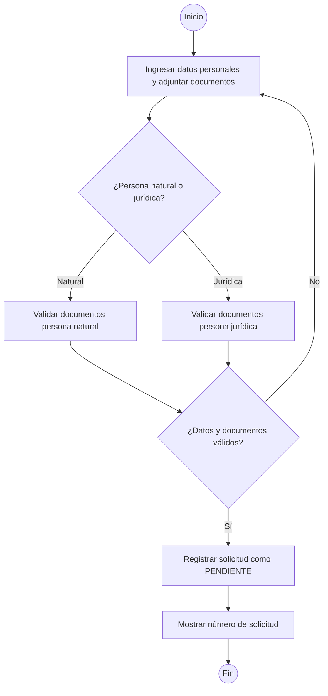

# Diagrama de Actividades - Registro de Vendedor

## Contexto: E-Commerce Comercial Konrad

## Listado de Actividades

| #   | Actividad                                                  |
| --- | ---------------------------------------------------------- |
| 1   | Ingresar datos personales y adjuntar documentos requeridos |
| 2   | Verificar tipo de persona (natural o jurídica)             |
| 3   | Validar formato de datos y documentos completos            |
| 4   | Registrar solicitud en estado PENDIENTE                    |
| 5   | Mostrar número de solicitud al solicitante                 |
