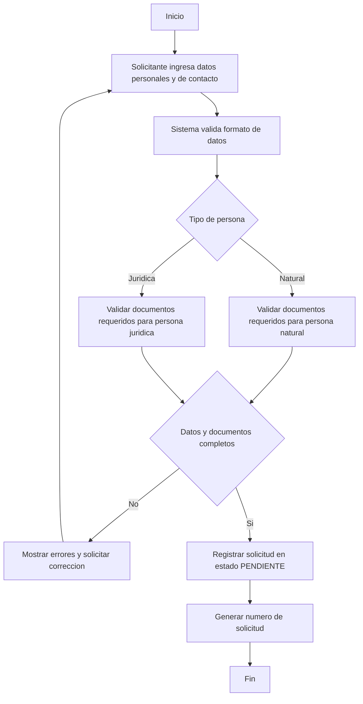
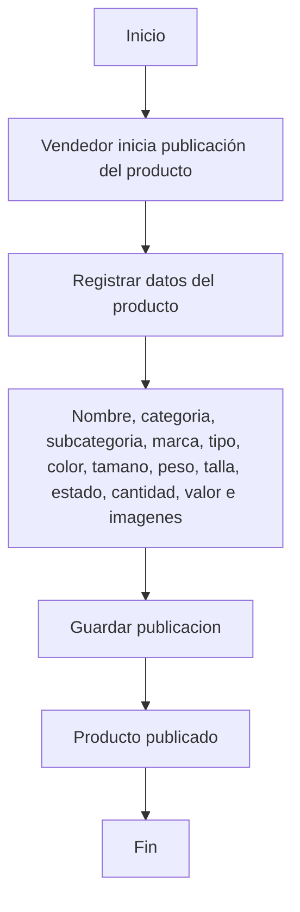
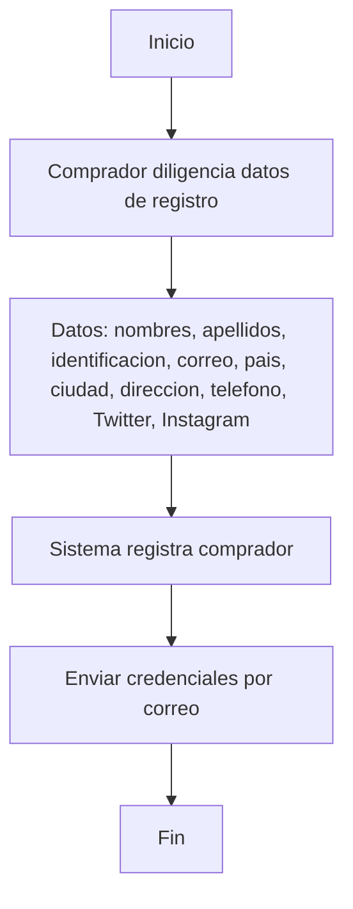
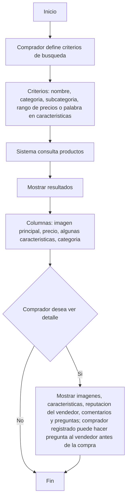
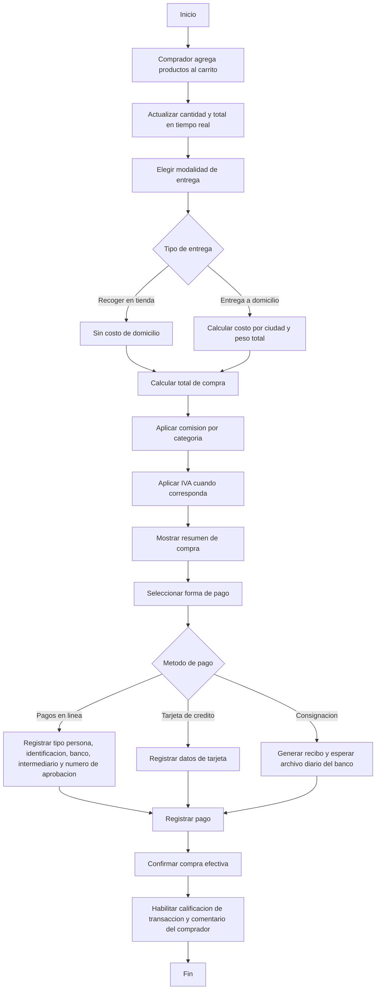
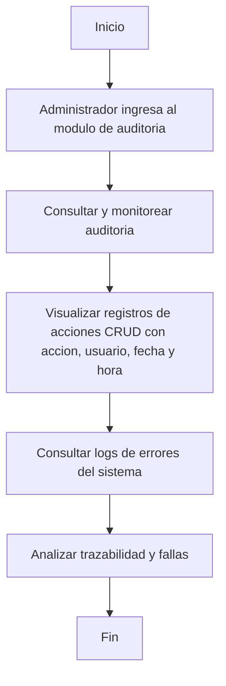
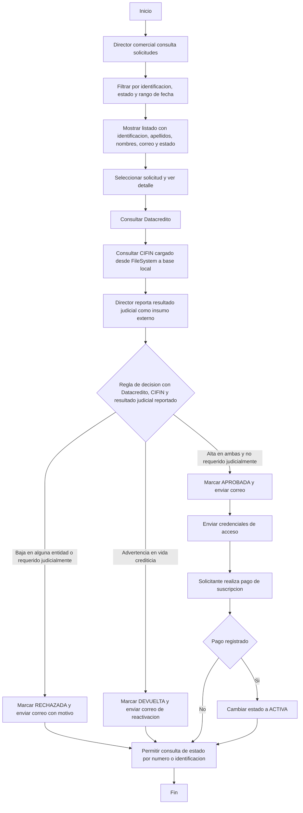
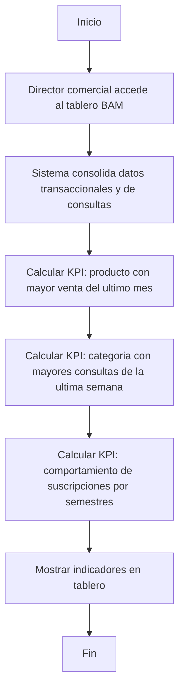

# Taller 3 - Funcionalidades

## 1) Registro Vendedor

## 2) Publicar productos

## 3) Registro de comprador

## 4) Consulta de productos

## 5) Comprar productos

## 6) Auditar sistema

## 7) Gestion de Solicitudes

## 8) Tablero de Control

