| Campo | Detalle |
|---|---|
| **Institución** | Fundación Universitaria Konrad Lorenz |
| **Grupo** | 51 |
| **Docente** | López Ospina Carlos Andrés |
| **Versión** | 1.0 |
| **Metodología** | Modelo 4+1 vistas (Kruchten) + Vista de Datos |

## Historial de Versiones {.unnumbered}

| Versión | Fecha | Autores | Descripción |
|---|---|---|---|
| 1.0 | Abril 2026 | Ávila, Criollo, Rocha, Vargas | Versión inicial del documento de arquitectura |

# Introducción

## Propósito

Este documento describe la arquitectura del sistema E-Commerce Konrad usando el modelo de 4+1 vistas extendido con Vista de Datos. Está dirigido al docente **López Ospina Carlos Andrés** y al equipo de desarrollo del grupo **51** de Ingeniería de Software I.

## Alcance

El sistema cubre los siguientes módulos funcionales:

- Registro y aprobación de vendedores (con integración Datacrédito, CIFIN y antecedentes judiciales)
- Gestión de suscripciones de vendedores
- Publicación y catálogo de productos
- Proceso de compra (carrito, pago, entrega)
- Interacción comprador-vendedor (preguntas, comentarios, calificaciones)
- Tablero de control BAM para el Director Comercial
- Administración del sistema (auditoría, logs, parametrización)

**Fuera de alcance:** implementación de sistemas bancarios externos, plataformas de redes sociales (solo integración de tendencias), infraestructura física de centros de datos.

## Glosario

| Término | Definición |
|---|---|
| **CIFIN** | Central de Información Financiera. Entidad colombiana que reporta historial crediticio. Entrega archivos planos mensuales en FileSystem. |
| **Datacrédito** | Entidad de historial crediticio expuesta como Web Service externo. |
| **DRP** | Disaster Recovery Plan. Plan y centro de datos alterno para recuperación ante desastres. |
| **FileSystem (FS)** | Sistema de archivos del servidor donde llegan archivos planos de CIFIN y consignaciones bancarias. |
| **NAS** | Network Attached Storage. Servidor de almacenamiento compartido en red. |
| **SOAP** | Simple Object Access Protocol. Protocolo de servicios web basado en XML. |
| **TPS** | Transacciones Por Segundo. Métrica de rendimiento del sistema. |
| **BAM** | Business Activity Monitoring. Tablero de KPIs en tiempo real para el Director Comercial. |
| **SPA** | Single Page Application. Aplicación web que carga una sola página HTML y actualiza contenido dinámicamente. |
| **ORM** | Object-Relational Mapping. Capa de abstracción entre objetos del dominio y tablas relacionales. |
| **BCrypt** | Algoritmo de hashing de contraseñas. Estándar recomendado por OWASP. |
| **AOP** | Aspect-Oriented Programming. Paradigma para separar concerns transversales (auditoría, logging) del código de negocio. |

## Objetivos Arquitectónicos

1. **Escalabilidad:** Soportar 200.000 usuarios concurrentes y 1.000 TPS mediante computación distribuida (clusters y balanceadores de carga).
2. **Alta disponibilidad:** Garantizar uptime del 99,7% con centro de datos alterno y replicación síncrona/asíncrona.
3. **Seguridad:** Autenticación robusta con roles, cifrado de contraseñas con BCrypt y comunicaciones exclusivamente sobre HTTPS.
4. **Mantenibilidad:** Auditoría centralizada de cada CRUD y log de errores mediante componentes transversales AOP.
5. **Integrabilidad:** Exposición de servicios hacia sistemas BI externos mediante SOAP; consumo de servicios externos mediante REST.
6. **Libertad de licenciamiento:** Stack 100% open source (OpenJDK, Spring Boot, Angular/React, PostgreSQL, Nginx).

## Restricciones Arquitectónicas

- Stack obligatorio open source: Java (OpenJDK) + Spring Boot (backend), Angular o React (frontend web), PostgreSQL (BD relacional).
- Comunicaciones externas sobre HTTPS (TCP 443).
- Servicios hacia BI externos deben usar SOAP XML.
- Archivos planos de CIFIN y consignaciones bancarias llegan via FileSystem; el sistema los procesa en lotes.
- Sin licencias propietarias ni frameworks comerciales.

# Vista de Casos de Uso

La vista de casos de uso establece los requisitos funcionales arquitectónicamente significativos, es decir, los que tienen mayor impacto en las decisiones de diseño del sistema.

## Actores

| Actor | Descripción |
|---|---|
| **Aspirante / Vendedor** | Persona natural o jurídica que solicita ser vendedor y, una vez aprobada y con suscripción activa, publica productos. |
| **Comprador** | Usuario registrado que busca, consulta, compra productos y califica transacciones. |
| **Director Comercial** | Rol interno que revisa solicitudes de vendedores, gestiona aprobaciones y consulta el tablero BAM. |
| **Administrador del Sistema** | Rol técnico que parametriza el sistema, consulta auditoría y monitorea logs de error. |

## Diagrama General de Casos de Uso

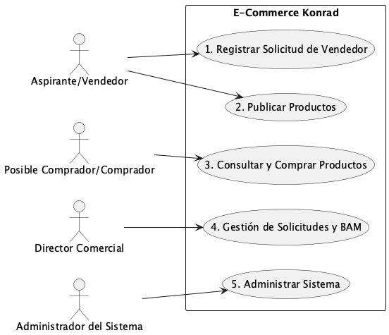

*Figura 1 — Diagrama General de Casos de Uso*

## Casos de Uso Arquitectónicamente Significativos

Los siguientes casos de uso son significativos para la arquitectura porque impactan decisiones de diseño, integraciones o mecanismos de concurrencia:

| ID | Caso de Uso | Impacto Arquitectónico |
|---|---|---|
| CU-01 | Registrar Solicitud de Vendedor | Integración con Datacrédito (WS), CIFIN (FileSystem→BD), validación de tipo de persona, correo certificado. |
| CU-03 | Comprar Productos | Carrito con cálculo en tiempo real, integración pasarela de pagos (Stripe/PayPal), procesamiento consignaciones (archivo bancario). |
| CU-04 | Gestión Director Comercial | Consulta concurrente a dos fuentes de riesgo externas + consulta manual judicial + reglas de negocio con múltiples estados. |
| CU-05 | Administrar Sistema | Parametrización sin código, consulta de auditoría centralizada y logs de error: justifica los paquetes `shared/auditoria` y `shared/logging`. |

# Vista Lógica

La vista lógica describe la descomposición del sistema en módulos, capas y componentes desde una perspectiva estática de responsabilidades.

## Nivel 1 — Contenedores Base

Muestra los contenedores principales del sistema sin detalles internos.

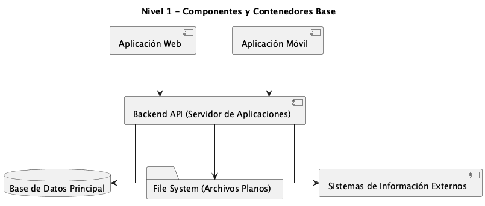

*Figura 2 — Vista Lógica Nivel 1: Contenedores Base*

## Nivel 2 — Componentes Internos y Protocolos

Muestra las capas internas de cada contenedor y los protocolos de comunicación.

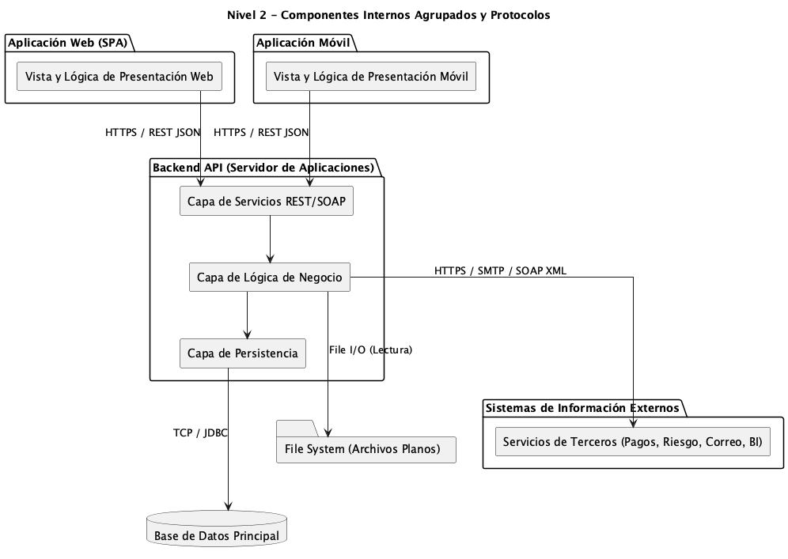

*Figura 3 — Vista Lógica Nivel 2: Componentes y Protocolos*

**Descripción de capas del backend:**

| Capa | Responsabilidad |
|---|---|
| **Capa de Servicios REST/SOAP** | Punto de entrada. Expone endpoints REST para clientes web/móvil y endpoints SOAP para sistemas BI. Valida contratos de entrada, delega a la capa de negocio. |
| **Capa de Lógica de Negocio** | Orquesta los procesos de negocio: aprobación de vendedores, cálculo de totales de compra, evaluación de calificaciones, gestión de suscripciones. Invoca servicios externos y auditoria. |
| **Capa de Persistencia (ORM)** | Abstrae el acceso a PostgreSQL mediante JPA/Hibernate. Gestiona transacciones, consultas y mapeo objeto-relacional. |

## Nivel 3 — Componentes Técnicos Detallados

Máximo detalle: librerías, clientes HTTP, ORM, y todos los sistemas externos diferenciados.

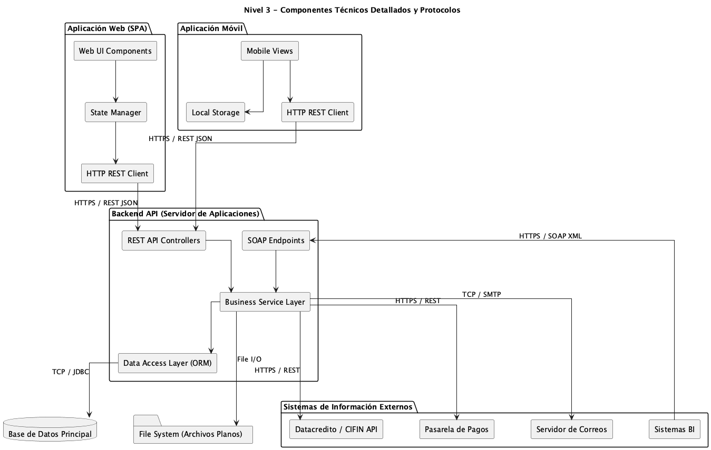

*Figura 4 — Vista Lógica Nivel 3: Componentes Técnicos Detallados*

# Vista de Procesos

La vista de procesos describe el comportamiento dinámico del sistema en tiempo de ejecución: flujos concurrentes, interacciones entre actores y mecanismos de comunicación.

## Proceso: Registro de Vendedor y Aprobación

Flujo completo desde la solicitud del aspirante hasta activación como vendedor con suscripción pagada.

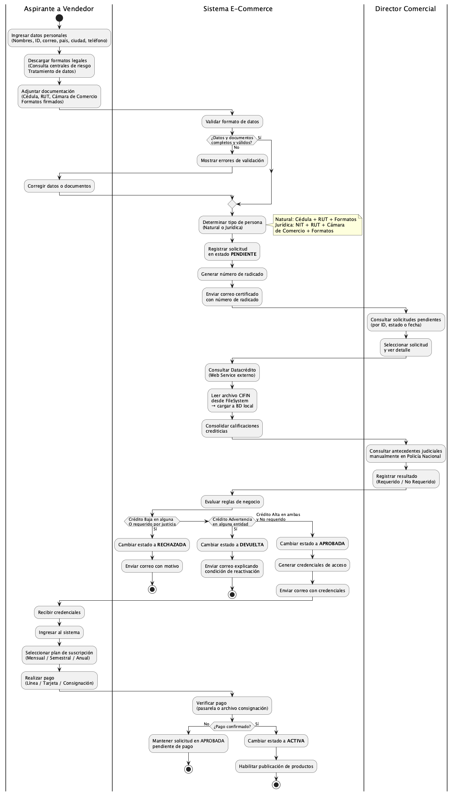

*Figura 5 — Proceso: Registro de Vendedor y Aprobación*

## Proceso: Compra de Productos

Flujo desde la búsqueda hasta la calificación post-transacción.

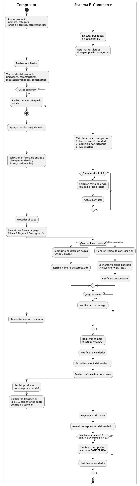

*Figura 6 — Proceso: Compra de Productos*

## Proceso: Gestión de Solicitudes — Director Comercial

Flujo de revisión crediticia y judicial con múltiples swimlanes de integración.

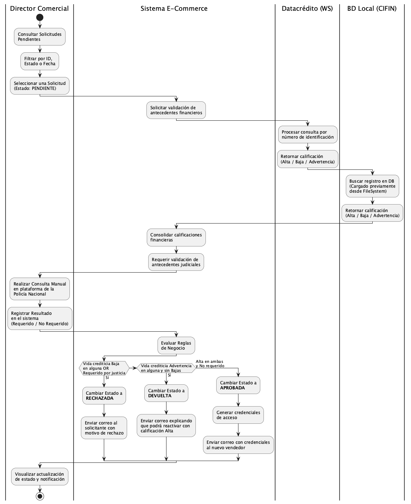

*Figura 7 — Proceso: Gestión de Solicitudes (Director Comercial)*

# Vista de Despliegue / Física

La vista física describe la distribución del software en la infraestructura de hardware y red.

## Topología Nivel 1 — Visión General

Muestra los nodos principales, clusters y el centro de datos alterno (DRP).

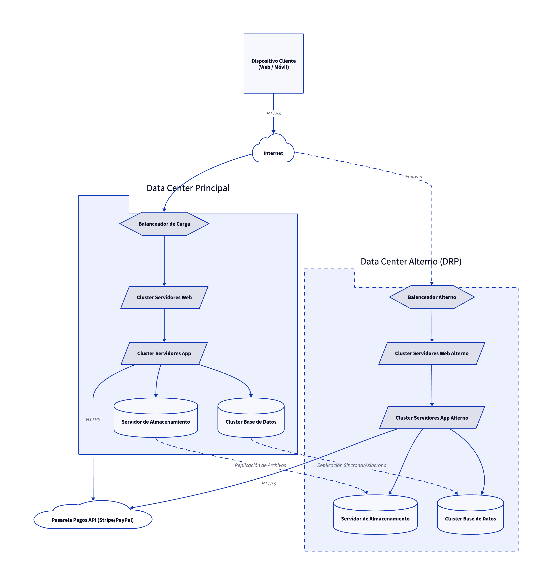

*Figura 8 — Vista Física: Topología de Despliegue Nivel 1*

## Topología Nivel 2 — Detalle Técnico

Detalla componentes internos de cada nodo y protocolos específicos (puertos TCP).

| Componente | Tecnología | Puerto |
|---|---|---|
| Balanceador de Carga | HAProxy / Nginx | TCP 443 (HTTPS entrada) |
| Cluster Servidores Web | Nginx / Apache | TCP 80/8080 |
| Cluster Servidores App | Java Spring Boot | TCP 3000/8080 |
| Base de Datos | PostgreSQL | TCP 5432 |
| Almacenamiento NAS | NFS Share | TCP 2049 |
| Pasarela de Pagos | Stripe / PayPal (externa) | HTTPS TCP 443 |

**Replicación entre Data Centers:**

- BD Principal → BD Standby: replicación síncrona/asíncrona TCP.
- NAS Principal → NAS Alterno: sincronización via rsync TCP.

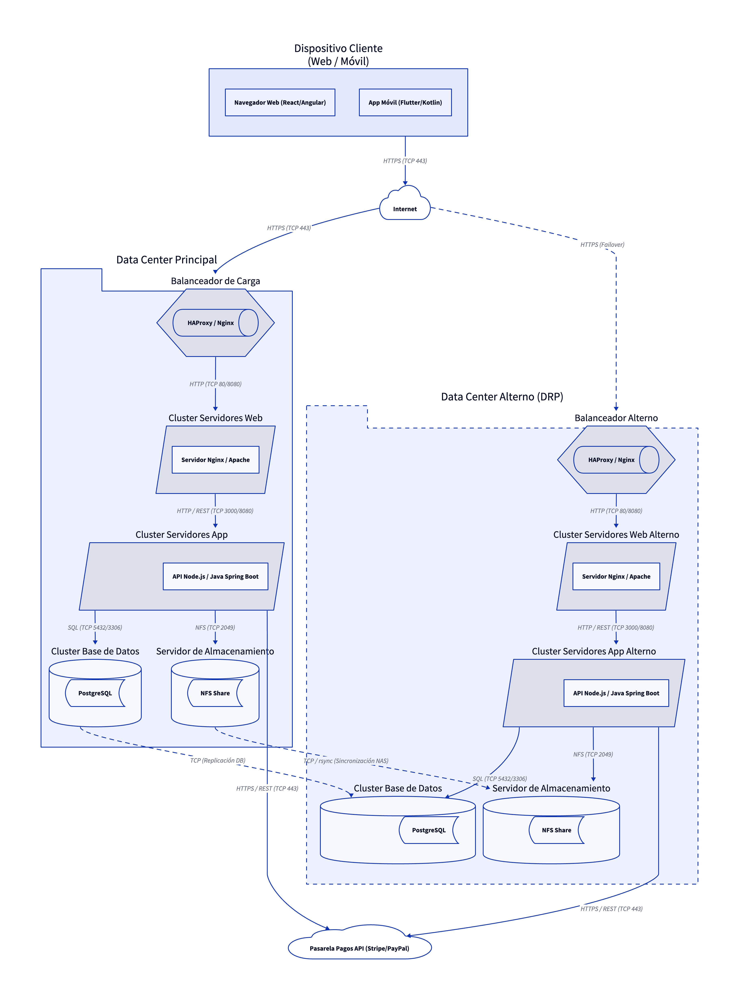

*Figura 9 — Vista Física: Topología de Despliegue Nivel 2 (Detalle Técnico)*

# Vista de Implementación

La vista de implementación describe la organización del código fuente en módulos, paquetes y dependencias.

## Estructura de Paquetes

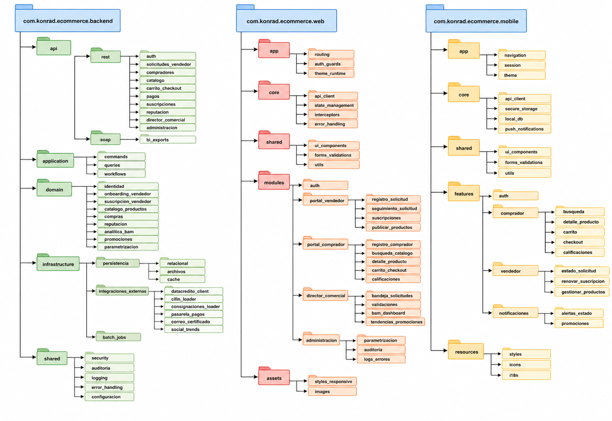

*Figura 10 — Vista de Implementación: Estructura de Paquetes*

## Descripción de Módulos Clave

| Módulo / Paquete | Responsabilidad |
|---|---|
| `api/rest/` | Controllers REST por dominio funcional. Validan entrada y delegan a la capa de aplicación. |
| `api/soap/bi_exports` | Web Services SOAP expuestos hacia sistemas BI externos. Contrato definido en WSDL. |
| `domain/` | Entidades y reglas de negocio puras. Sin dependencias de infraestructura. |
| `infrastructure/integraciones_externas/` | Clientes para Datacrédito, CIFIN, consignaciones, pasarela de pagos y correo certificado. |
| `infrastructure/persistencia/archivos` | Lectura y procesamiento de archivos planos (CIFIN, consignaciones) desde FileSystem. |
| `shared/auditoria` | Aspecto transversal: registra toda acción CRUD (qué acción, quién, cuándo). |
| `shared/logging` | Aspecto transversal: captura y persiste errores del sistema. |
| `shared/security` | Módulo de autenticación, autorización por roles y cifrado de contraseñas (BCrypt). |

# Vista de Datos

La vista de datos describe el modelo de persistencia relacional: entidades, atributos y relaciones.

## Modelo Entidad-Relación

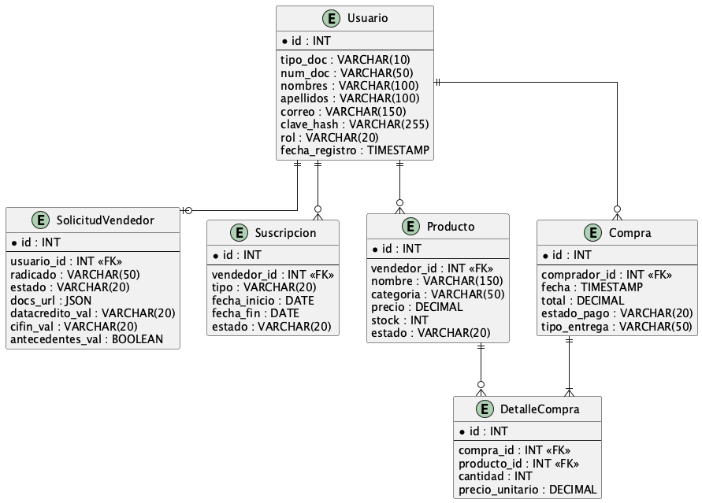

*Figura 11 — Modelo Entidad-Relación*

## Descripción de Entidades Principales

| Entidad | Descripción | Atributos clave |
|---|---|---|
| **Usuario** | Centraliza todos los actores del sistema (Vendedor, Comprador, Admin, Director). El atributo `rol` determina el perfil. | `clave_hash` (BCrypt), `rol` |
| **SolicitudVendedor** | Registra el proceso de onboarding del vendedor, incluyendo resultados de verificación crediticia y judicial. | `estado` (PENDIENTE/APROBADA/RECHAZADA/DEVUELTA/ACTIVA), `datacredito_val`, `cifin_val`, `antecedentes_val` |
| **Suscripcion** | Controla la vigencia del vendedor en la plataforma. El campo `estado` soporta los estados EN MORA y CANCELADA. | `tipo` (mensual/semestral/anual), `estado` |
| **Producto** | Catálogo de productos publicados por vendedores activos. Las imágenes referencian rutas en el NAS. | `categoria`, `precio`, `stock` |
| **Compra** | Encabezado de la transacción de compra. | `estado_pago`, `tipo_entrega` |
| **DetalleCompra** | Ítem por ítem de cada compra (relación M:N entre Compra y Producto). | `cantidad`, `precio_unitario` |

# Requerimientos No Funcionales

Extraídos del enunciado del sistema y formalizados según categorías funcionales.

| ID | Nombre | Prioridad | Descripción resumida |
|---|---|---|---|
| RNF-01 | Seguridad en Autenticación y Contraseñas | Alta | Módulo de autenticación con roles, contraseñas cifradas con BCrypt, comunicaciones HTTPS, correos certificados. |
| RNF-02 | Desempeño y Alta Disponibilidad | Alta | 200.000 usuarios concurrentes, 1.000 TPS, uptime 99,7%, centro de datos alterno (DRP), backup diario. |
| RNF-03 | Interfaz Gráfica Responsive | Media | Interfaz adaptativa para móvil/tablet/escritorio. Parametrización de imagen corporativa desde panel admin sin tocar código. |
| RNF-04 | Almacenamiento y Crecimiento | Alta | Soporte para crecimiento del 200% en datos y archivos. Backup diario sin afectar producción. |
| RNF-05 | Mantenimiento — Auditoría y Logs | Alta | Registro de auditoría por cada CRUD (acción, usuario, fecha, hora). Log de errores por cada falla. |
| RNF-06 | Tecnología Libre de Licenciamiento | Media | Stack 100% open source en sus últimas versiones estables con soporte activo. |
| RNF-07 | Integración SOAP hacia BI | Media | Servicios expuestos hacia sistemas externos de BI deben usar protocolo SOAP/XML. |

# Trazabilidad RNF ↔ Arquitectura

Esta matriz responde directamente a la pregunta del enunciado: ¿en qué vista, en qué capa, en qué componente, en qué clase se está abordando cada RNF?

| RNF | Vista(s) | Capa | Componente / Paquete | Mecanismo concreto |
|---|---|---|---|---|
| **RNF-01** Seguridad | Lógica (N3), Física, Implementación, Datos | Infraestructura / Seguridad / BD | `shared/security`, `api/rest/auth`, HTTPS en balanceador, `Usuario.clave_hash` | BCrypt para hash de contraseñas. HTTPS desde cliente hasta balanceador (TCP 443). Roles en `Usuario.rol` restringen acceso por endpoint. |
| **RNF-02** Desempeño | Física (N1 y N2), Lógica | Infraestructura (clusters) | Cluster Serv. Web, Cluster Serv. App, Cluster BD, Balanceador (HAProxy/Nginx), Data Center DRP | Clusters horizontales absorben 200k usuarios concurrentes. Balanceador distribuye TPS. Failover automático al DRP con replicación síncrona de BD. |
| **RNF-03** Responsive | Implementación, Casos de Uso | Frontend / Admin | `web/assets/styles_responsive`, `web/modules/administracion/parametrizacion`, CU-05 (Administrar Sistema) | SPA con CSS breakpoints. Panel de parametrización de imagen corporativa sin modificar código. |
| **RNF-04** Almacenamiento | Física, Implementación, Datos | Infraestructura / Persistencia / NAS | `NAS_Principal`, `NAS_Alterno`, `infrastructure/persistencia/archivos`, `SolicitudVendedor.docs_url` | Archivos en NAS (no BLOBs en BD). Replicación NAS→NAS_Alterno via rsync. Cluster BD con réplica para backup sin downtime. |
| **RNF-05** Mantenimiento | Implementación, Lógica, Casos de Uso | Cross-cutting / Negocio / Admin | `shared/auditoria`, `shared/logging`, `web/modules/administracion/auditoria`, `web/modules/administracion/logs_errores` | AOP intercepta toda operación CRUD → escribe en tabla de auditoría. Errores capturados globalmente en `shared/logging` → FileSystem de logs. CU-05 permite consultar desde UI. |
| **RNF-06** Tecnología | Implementación | Todo el stack | Todo el árbol de paquetes | Spring Boot (Apache License), Angular/React (MIT), PostgreSQL (BSD), Nginx (BSD), BCrypt (open source). Sin licencias propietarias en ninguna capa. |
| **RNF-07** Integración SOAP | Lógica (N3), Implementación | API / Integración | `api/soap/bi_exports`, componente `[SOAP Endpoints]` del Nivel 3 | SOAP Endpoints independientes de los REST Controllers. Contrato WSDL versionado. Comunicación cifrada HTTPS / SOAP XML (TCP 443). |

# Referencias

| Recurso | Ubicación |
|---|---|
| Contexto y enunciado del taller | `Taller-6/0-Contexto-Taller-6.md` |
| RNF formales (Taller 5) | `Taller-5/1-RNF.md` |
| Cumplimiento RNF detallado | `Taller-6/Cumplimiento-RNF.md` |
| Casos de uso (diagramas) | `Taller-6/Casos-de-Uso/` |
| Vista Lógica (3 niveles) | `Taller-6/Vista-Logica/` |
| Vista Procesos (3 diagramas) | `Taller-6/Vista-Procesos/` |
| Vista Física (D2 N1 y N2) | `Taller-6/Vista-Fisica/` |
| Vista Implementación | `Taller-6/Vista-Implementacion/` |
| Vista Datos (MER PlantUML) | `Taller-6/Vista-Datos/` |
