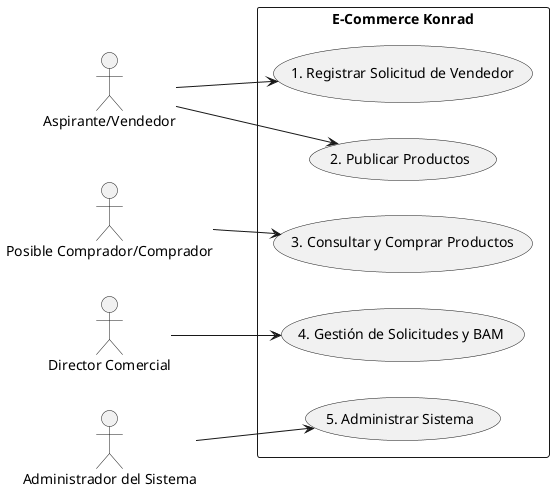

# Diagrama de Casos de Uso General

Este diagrama representa a alto nivel los actores principales del E-Commerce Konrad y los casos de uso agrupados que interactúan con el sistema.

```plantuml
@startuml
left to right direction
skinparam packageStyle rectangle

actor "Aspirante/Vendedor" as Vendedor
actor "Posible Comprador/Comprador" as Comprador
actor "Director Comercial" as Director
actor "Administrador del Sistema" as Admin

rectangle "E-Commerce Konrad" {
  usecase "1. Registrar Solicitud de Vendedor" as UC1
  usecase "2. Publicar Productos" as UC2
  usecase "3. Consultar y Comprar Productos" as UC3
  usecase "4. Gestión de Solicitudes y BAM" as UC4
  usecase "5. Administrar Sistema" as UC5
}

Vendedor --> UC1
Vendedor --> UC2

Comprador --> UC3

Director --> UC4

Admin --> UC5

@enduml
```