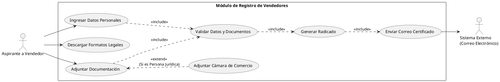

# Caso de Uso: Registrar solicitud para ser vendedor

Diagrama específico basado en el documento de requerimientos detallados (`casos-uso-registrar-solicitud-vendedor.md`).

```plantuml
@startuml
left to right direction

actor "Aspirante a Vendedor" as Aspirante
actor "Sistema Externo\n(Correo Electrónico)" as Correo

rectangle "Módulo de Registro de Vendedores" {
  usecase "Ingresar Datos Personales" as UC1
  usecase "Descargar Formatos Legales" as UC2
  usecase "Adjuntar Documentación" as UC3
  usecase "Adjuntar Cámara de Comercio" as UC3_1
  usecase "Validar Datos y Documentos" as UC4
  usecase "Generar Radicado" as UC5
  usecase "Enviar Correo Certificado" as UC6
}

Aspirante --> UC1
Aspirante --> UC2
Aspirante --> UC3

UC3 <.. UC3_1 : <<extend>> \n(Si es Persona Jurídica)

UC1 ..> UC4 : <<include>>
UC3 ..> UC4 : <<include>>
UC4 ..> UC5 : <<include>>
UC5 ..> UC6 : <<include>>

UC6 --> Correo
@enduml
```