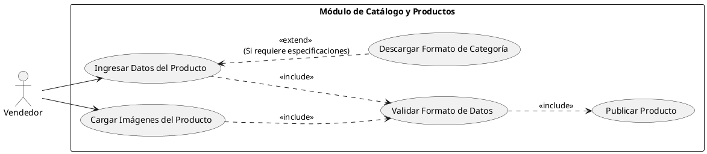

# Caso de Uso: Publicar productos

Diagrama específico basado en el documento de requerimientos detallados (`casos-uso-publicar-productos.md`).

```plantuml
@startuml
left to right direction

actor "Vendedor" as Vendedor

rectangle "Módulo de Catálogo y Productos" {
  usecase "Ingresar Datos del Producto" as UC1
  usecase "Cargar Imágenes del Producto" as UC2
  usecase "Validar Formato de Datos" as UC3
  usecase "Descargar Formato de Categoría" as UC4
  usecase "Publicar Producto" as UC5
}

Vendedor --> UC1
Vendedor --> UC2

UC1 <.. UC4 : <<extend>> \n(Si requiere especificaciones)
UC1 ..> UC3 : <<include>>
UC2 ..> UC3 : <<include>>
UC3 ..> UC5 : <<include>>

@enduml
```