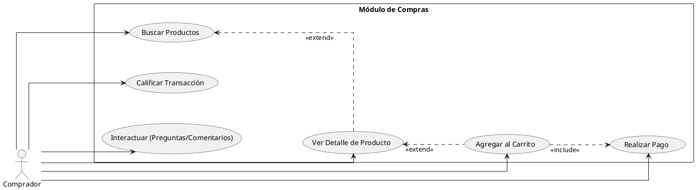

# Caso de Uso: Consultar y comprar productos

Diagrama específico basado en los requerimientos del comprador (Búsqueda, Carrito, Pago, Calificación).

```plantuml
@startuml
skinparam linetype ortho
skinparam nodesep 60
skinparam ranksep 60
left to right direction

actor "Comprador" as Comprador

rectangle "Módulo de Compras" {
  usecase "Buscar Productos" as UC1
  usecase "Ver Detalle de Producto" as UC2
  usecase "Agregar al Carrito" as UC3
  usecase "Realizar Pago" as UC4
  usecase "Calificar Transacción" as UC5
  usecase "Interactuar (Preguntas/Comentarios)" as UC6
}

Comprador ---> UC1
Comprador ---> UC2
Comprador ---> UC3
Comprador ---> UC4
Comprador ---> UC5
Comprador ---> UC6

UC1 <... UC2 : <<extend>>
UC2 <... UC3 : <<extend>>
UC3 ...> UC4 : <<include>>
@enduml
```
