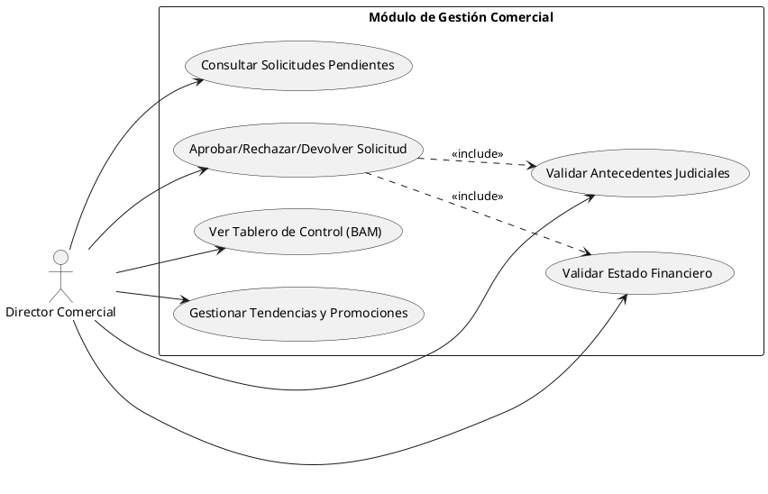

# Caso de Uso: Gestión del Director Comercial

Diagrama específico para las actividades del Director Comercial, incluyendo la revisión de solicitudes, validación de antecedentes y uso del tablero de control (BAM).

