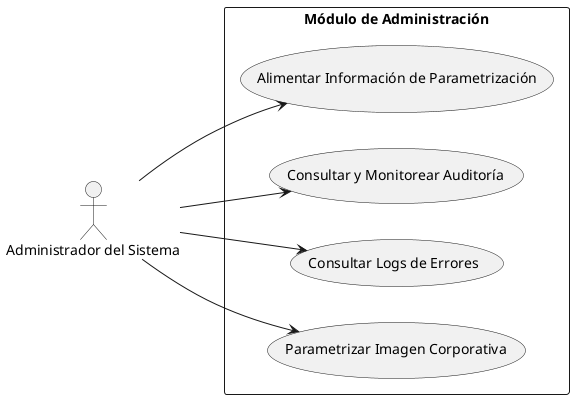

# Caso de Uso: Administración del Sistema

Diagrama que documenta las capacidades del Administrador del Sistema, centrado en parametrización y soporte.

```plantuml
@startuml
left to right direction

actor "Administrador del Sistema" as Admin

rectangle "Módulo de Administración" {
  usecase "Alimentar Información de Parametrización" as UC1
  usecase "Consultar y Monitorear Auditoría" as UC2
  usecase "Consultar Logs de Errores" as UC3
  usecase "Parametrizar Imagen Corporativa" as UC4
}

Admin --> UC1
Admin --> UC2
Admin --> UC3
Admin --> UC4

@enduml
```