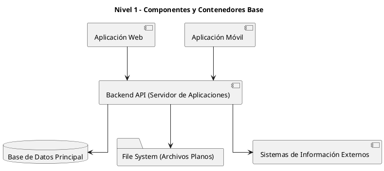

# Diagrama de Componentes (Nivel 1)

Este diagrama representa el nivel más alto de abstracción, mostrando únicamente los componentes o contenedores principales del sistema E-Commerce Konrad, sin detalles técnicos ni descripción en sus conexiones.

