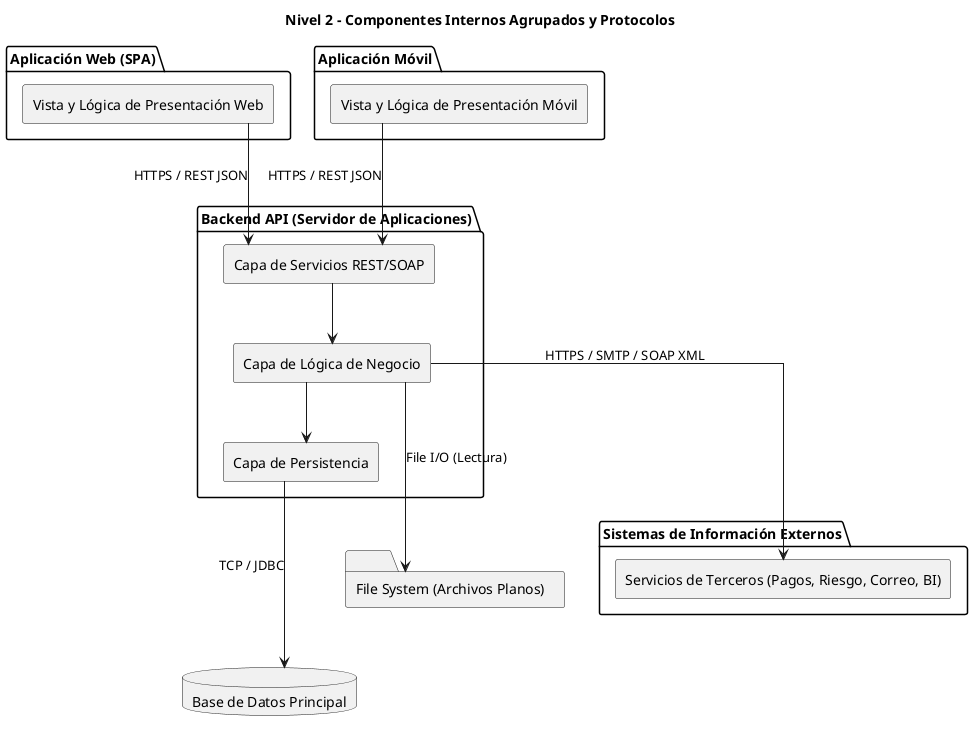

# Diagrama de Componentes (Nivel 2)

Este diagrama conserva las mismas cajas (contenedores) del Nivel 1, mostrando componentes internos agrupados y comprimidos de forma genérica (capas principales). Las conexiones detallan los protocolos de comunicación de forma sencilla.

