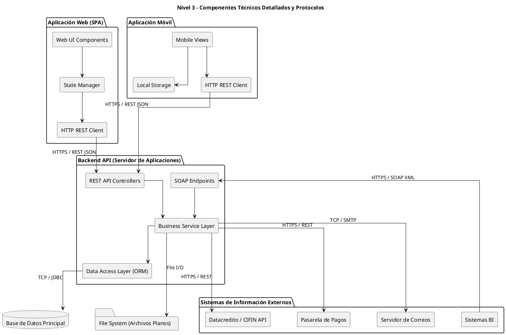

# Diagrama de Componentes (Nivel 3)

Este diagrama representa el nivel más técnico y detallado (el anterior Nivel 2). Mantiene los contenedores base pero desglosa los componentes internos exactos, librerías y dependencias (State Manager, ORM, clientes HTTP), junto con sus protocolos de comunicación específicos en cada flecha. Se ha estructurado el layout (arriba hacia abajo) para una visualización más limpia, simétrica y estética.

