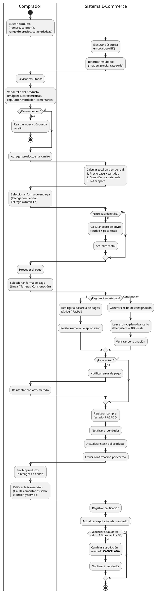

# Diagrama de Procesos: Compra de Productos

Este diagrama documenta el flujo dinámico del proceso de compra, desde la búsqueda de un producto hasta la calificación post-transacción. Diferencia el comprador, el sistema E-Commerce y los servicios externos de pago.

