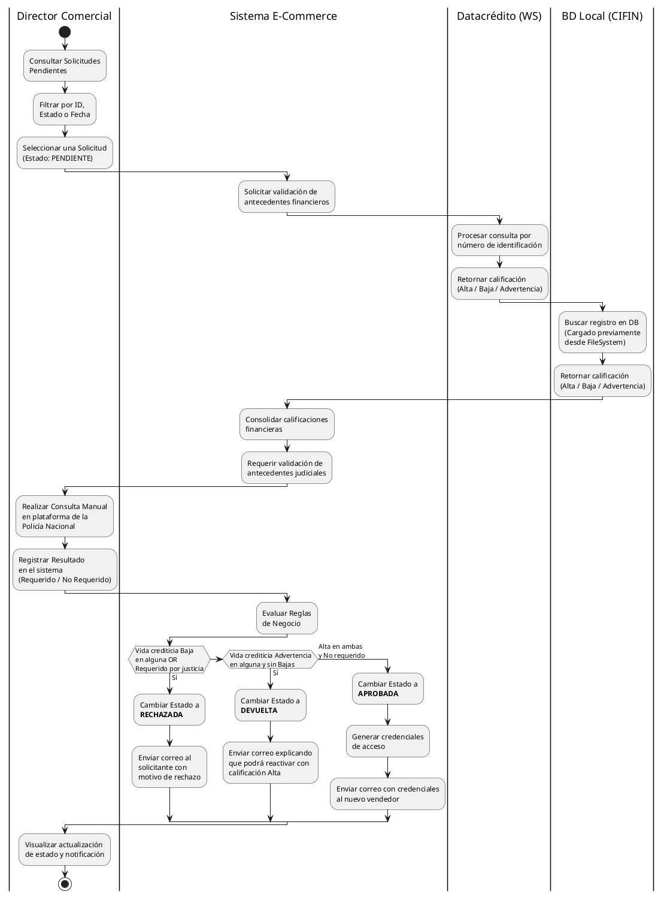

# Diagrama de Procesos (Actividades Concurrentes)

Este diagrama documenta la secuencia dinámica e interacciones para el caso de uso central de "Revisión de Solicitudes de Vendedor por el Director Comercial" (alineado con `Casos-de-Uso/4-Gestion-Director-Comercial.md`). 

Se detalla a mayor profundidad la arquitectura de procesos separando las responsabilidades en múltiples carriles (swimlanes), diferenciando el sistema central de las integraciones (Web Service y Base de Datos Local). Se han ajustado los textos para optimizar el espacio horizontal y el flujo se presenta de forma secuencial para mayor claridad visual.

