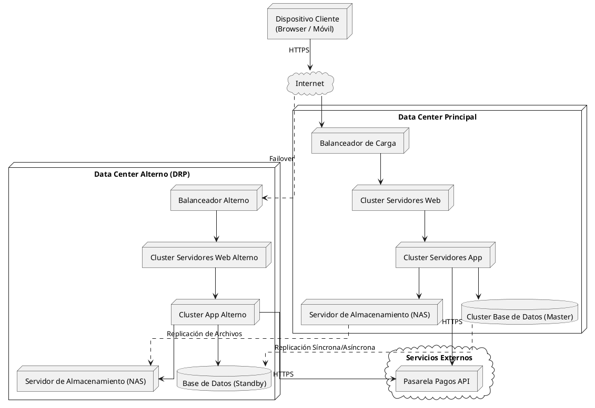

# Topología de Despliegue (Nivel 1)

Este diagrama representa la infraestructura general del sistema y los nodos físicos, incluyendo el centro de datos alterno para cumplir con el RNF-02 (Alta disponibilidad 99,7% y Recuperación ante desastres).

