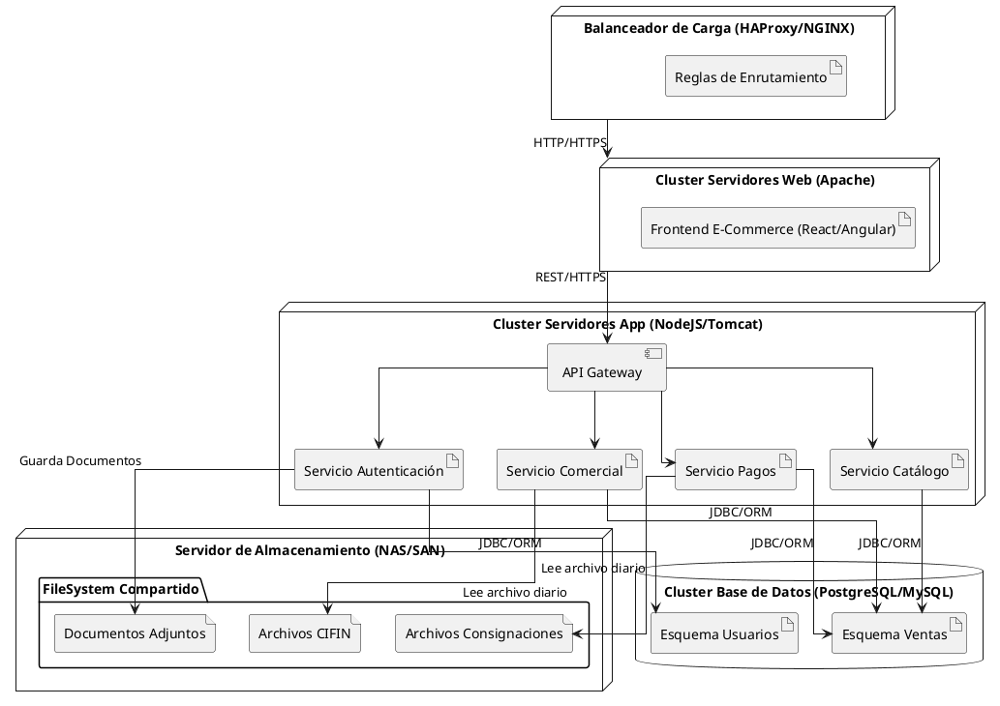

# Detalle de Nodos (Nivel 2)

Este diagrama hace un zoom en la distribución de los artefactos de software dentro de los nodos de procesamiento, asegurando coherencia con el nivel 1.

```plantuml
@startuml
skinparam linetype ortho

node "Balanceador de Carga (HAProxy/NGINX)" as LB {
   artifact "Reglas de Enrutamiento" as ReglasLB
}

node "Cluster Servidores Web (Apache)" as WebNode {
  artifact "Frontend E-Commerce (React/Angular)" as Frontend
}

node "Cluster Servidores App (NodeJS/Tomcat)" as AppNode {
  component "API Gateway" as APIGW
  
  artifact "Servicio Autenticación" as AuthServ
  artifact "Servicio Catálogo" as CatServ
  artifact "Servicio Pagos" as PayServ
  artifact "Servicio Comercial" as ComServ
  
  APIGW --> AuthServ
  APIGW --> CatServ
  APIGW --> PayServ
  APIGW --> ComServ
}

node "Servidor de Almacenamiento (NAS/SAN)" as NASNode {
  folder "FileSystem Compartido" {
    file "Archivos CIFIN" as ArchivoCIFIN
    file "Archivos Consignaciones" as ArchivoBancos
    file "Documentos Adjuntos" as Docs
  }
}

database "Cluster Base de Datos (PostgreSQL/MySQL)" as DBNode {
  artifact "Esquema Ventas" as EsquemaVentas
  artifact "Esquema Usuarios" as EsquemaUsuarios
}

LB --> WebNode : HTTP/HTTPS
WebNode --> APIGW : REST/HTTPS

ComServ --> ArchivoCIFIN : Lee archivo diario
PayServ --> ArchivoBancos : Lee archivo diario
AuthServ --> Docs : Guarda Documentos

AuthServ --> EsquemaUsuarios : JDBC/ORM
CatServ --> EsquemaVentas : JDBC/ORM
PayServ --> EsquemaVentas : JDBC/ORM
ComServ --> EsquemaVentas : JDBC/ORM

@enduml
```