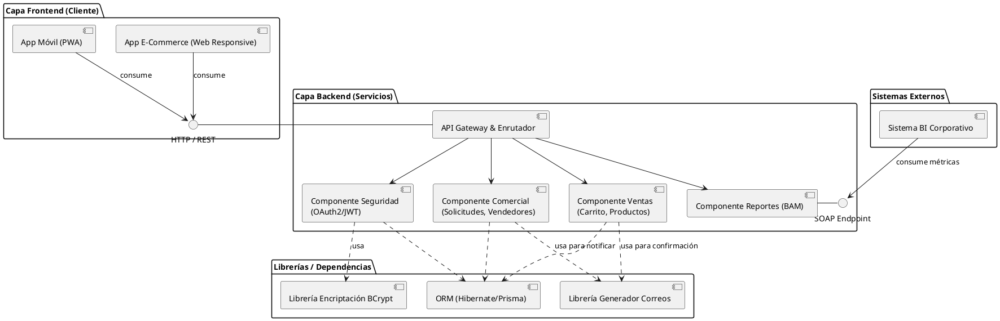

# Diagrama de Implementación (Componentes)

Este diagrama modela la vista de componentes de software (código, librerías, APIs), sus interfaces provistas y requeridas, destacando la capa web (Responsive) y las integraciones (SOAP para BI según RNF-03 y RNF).

