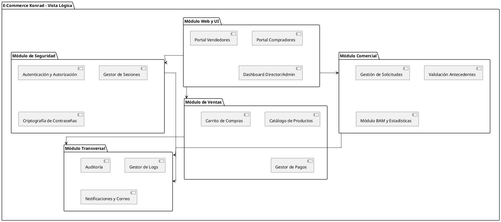

# Diagrama de Paquetes (Nivel 1)

Este diagrama representa la vista lógica a nivel macro, dividiendo el sistema en módulos o paquetes principales que agrupan la funcionalidad de manera limpia.

```plantuml
@startuml
skinparam linetype ortho
skinparam nodesep 50
skinparam ranksep 60

package "E-Commerce Konrad - Vista Lógica" {

  package "Módulo Web y UI" as UI {
    [Portal Compradores]
    [Portal Vendedores]
    [Dashboard Director/Admin]
  }

  package "Módulo de Seguridad" as Seguridad {
    [Autenticación y Autorización]
    [Gestor de Sesiones]
    [Criptografía de Contraseñas]
  }

  package "Módulo Comercial" as Comercial {
    [Gestión de Solicitudes]
    [Validación Antecedentes]
    [Módulo BAM y Estadísticas]
  }

  package "Módulo de Ventas" as Ventas {
    [Catálogo de Productos]
    [Carrito de Compras]
    [Gestor de Pagos]
  }

  package "Módulo Transversal" as Transversal {
    [Auditoría]
    [Gestor de Logs]
    [Notificaciones y Correo]
  }
}

UI --> Seguridad
UI --> Comercial
UI --> Ventas

Seguridad --> Transversal
Comercial --> Transversal
Ventas --> Transversal

' Lineas ocultas para organizar mejor el layout
UI -[hidden]-> Comercial
Seguridad -[hidden]-> Transversal

@enduml
```