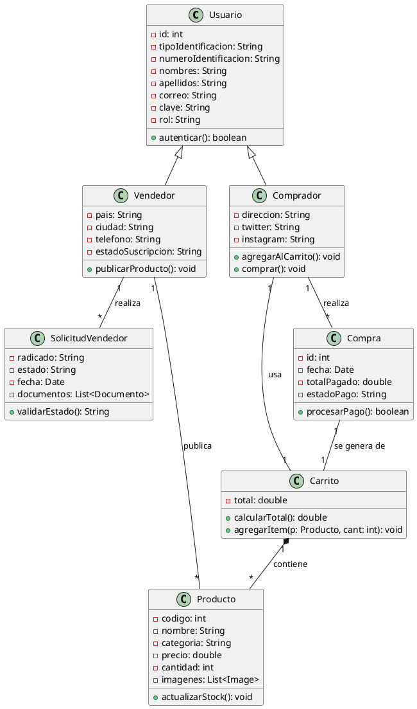

# Diagrama de Clases (Nivel 2)

Este diagrama representa el dominio central del sistema y las relaciones lógicas entre las principales entidades del negocio (Solicitud, Vendedor, Producto, Compra).

