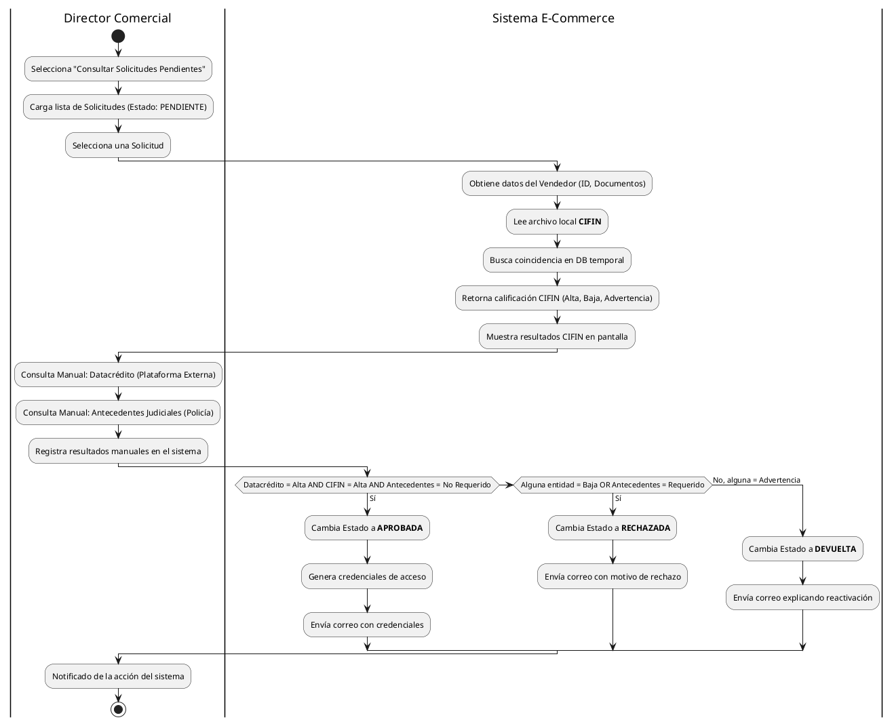

# Diagrama de Procesos (Actividades Concurrentes)

Este diagrama documenta la secuencia dinámica e interacciones para el caso de uso central de "Aprobación y Validación de Solicitudes de Vendedor", mostrando llamadas a sistemas asíncronos y toma de decisiones, sin integración API hacia Datacrédito.

